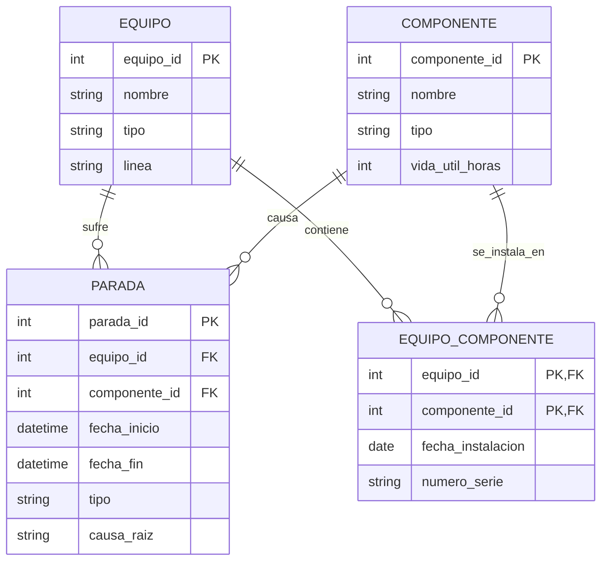

# Semana 6 · ERD del caso — Línea de empaque L2 (Café)

**Caso:** planta agroindustrial del Huila que tuesta y empaca café. Se analiza la línea de empaque L2 (≈60 % del volumen despachado, dos turnos). Objetivo: estimar la probabilidad de una parada no programada en las próximas 72 horas e identificar el equipo/componente más probable como causante.

---

## 1. ERD (mínimo 3 entidades, PK/FK, relación N:M con tabla intermedia)

**Entidades y llaves:**

| Entidad | PK | FK |
|---|---|---|
| `EQUIPO` | `equipo_id` | — |
| `COMPONENTE` | `componente_id` | — |
| `EQUIPO_COMPONENTE` (tabla intermedia) | (`equipo_id`, `componente_id`) | `equipo_id`→EQUIPO, `componente_id`→COMPONENTE |
| `PARADA` | `parada_id` | `equipo_id`→EQUIPO, `componente_id`→COMPONENTE |

**Relación N:M:** un `EQUIPO` está compuesto por muchos `COMPONENTE` (motores, bandas, válvulas), y un mismo `COMPONENTE` (mismo modelo/repuesto) puede estar instalado en varios `EQUIPO` de la línea. Se resuelve con la tabla intermedia `EQUIPO_COMPONENTE`, que además guarda `fecha_instalacion` y `numero_serie` de esa instalación puntual.

---

## 2. ¿Relacional o NoSQL?

**Relacional.** Las entidades (equipos, componentes, paradas) tienen una estructura fija y estable, y el análisis depende de **integridad referencial** (toda parada debe apuntar a un equipo y, si se conoce, a un componente válido) y de **consultas agregadas tipo JOIN** (ej. "paradas por equipo en los últimos 30 días", "componente con más fallas"). El volumen de estas tablas es moderado, no es un caso de datos masivos o no estructurados que justifique NoSQL.

*(Si más adelante se incorporan lecturas continuas de sensores como serie de tiempo de muy alto volumen, esa parte sí se manejaría en una base NoSQL/series de tiempo aparte, pero el modelo de negocio central se queda relacional.)*

---

## 3. Normalización aplicada

- Se separó `EQUIPO_COMPONENTE` de `EQUIPO` y `COMPONENTE`: así **no se repiten** los datos generales del componente (nombre, tipo, vida útil) cada vez que se instala en un equipo distinto; solo se repiten las claves `equipo_id`/`componente_id`.
- En `PARADA` **no se repiten** los atributos del equipo ni del componente (nombre, tipo, etc.); solo se referencian por `equipo_id` y `componente_id` (FK), evitando datos duplicados y manteniendo cada dato descriptivo en una única tabla (1FN/3FN).
