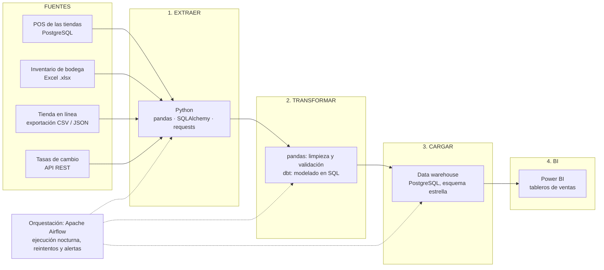
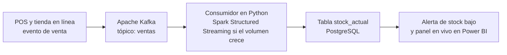

# Pipeline ETL del caso — Análisis de ventas de una cadena de tiendas de ropa

**Caso:** una cadena de tiendas de ropa con sedes en Neiva, Bogotá, Medellín y Cali quiere analizar sus ventas en un solo lugar. Los datos llegan de varias fuentes: el punto de venta (POS) de cada tienda, el inventario que maneja bodega en Excel, los clientes y pedidos de la tienda en línea, y una API externa de tasas de cambio (parte de los proveedores se paga en dólares).

| | |
|---|---|
| **Estudiante** | `FULL_NAME` |
| **Usuario GitHub** | `GITHUB_USER` |
| **Herramientas** | Python 3, pandas, requests, Apache Airflow, dbt, PostgreSQL, Apache Kafka, Power BI |

## Objetivos

- Diseñar un flujo ETL de extremo a extremo.
- Consumir datos de una API.

## Índice

1. [Diagrama del pipeline ETL con herramienta por etapa](#1-diagrama-del-pipeline-etl)
2. [Qué es batch y qué es streaming, y por qué](#2-batch-y-streaming)
3. [(Opcional) Consumir una API pública con `requests`](#3-opcional-consumir-una-api-pública-con-requests)

---

## 1. Diagrama del pipeline ETL

El flujo va de las fuentes hasta el tablero de BI: **fuentes → extraer → transformar → cargar → BI**. Apache Airflow orquesta todo el proceso.



### Herramienta y función por etapa

| Etapa | Herramienta | Qué hace en este caso |
|---|---|---|
| **Fuentes** | PostgreSQL (POS), Excel (inventario), CSV/JSON (tienda en línea), API REST (tasas de cambio) | Generan los datos originales, cada una con su propio formato. |
| **Extraer** | Python con `pandas`, `SQLAlchemy` y `requests` | `SQLAlchemy` lee las ventas del POS; `pandas` lee el Excel y los CSV/JSON; `requests` consume la API de tasas de cambio. |
| **Transformar** | `pandas` y `dbt` | `pandas` limpia (duplicados, nulos, fechas y precios con formato distinto) y valida la calidad; `dbt` arma los modelos en SQL (ventas por tienda, por producto, en pesos). |
| **Cargar** | PostgreSQL como data warehouse | Guarda los datos limpios en un esquema estrella: una tabla de hechos `VENTA` y dimensiones `CLIENTE`, `TIENDA`, `PRODUCTO` y `CATEGORIA` (las mismas entidades del ERD del caso). |
| **BI** | Power BI (alternativa gratuita: Metabase) | Muestra tableros: ingresos por categoría, ticket promedio por ciudad, ventas por mes. |
| **Orquestación** | Apache Airflow | Programa el pipeline cada noche, reintenta si algo falla y avisa por alerta. |

### Control de calidad dentro del pipeline

En la etapa de transformación se agregan validaciones antes de cargar: no dejar nulos en campos obligatorios, no aceptar cantidades ni precios negativos, y no cargar ventas duplicadas. Si una validación falla, el pipeline se detiene y avisa, en lugar de cargar datos malos al almacén.

---

## 2. Batch y streaming

La cadena no necesita todo en tiempo real. Usa **batch** para el análisis y **streaming** solo donde la rapidez cambia una decisión.

### Partes que serían batch

| Parte | Frecuencia | Por qué es batch |
|---|---|---|
| Ventas del POS al data warehouse | Cada noche | Los reportes de ventas se consultan al día siguiente. Procesar por lotes es más simple y barato, y permite validar la calidad antes de cargar. |
| Inventario de bodega (Excel) | Diario | El archivo se actualiza una vez al día; no hay un flujo continuo que procesar. |
| Clientes y pedidos de la tienda en línea | Cada noche | El análisis de clientes no pierde valor por esperar unas horas. |
| Tasas de cambio (API) | Diario | La tasa de referencia se publica una vez al día; consultarla cada segundo no aporta nada. |
| Modelos de `dbt` y reportes gerenciales | Cada noche | Se recalculan sobre los datos ya cargados. |

### Partes que serían streaming

| Parte | Por qué es streaming |
|---|---|
| **Stock en tiempo real** | Las tiendas físicas y la tienda en línea comparten inventario. Si se vende la última unidad en Bogotá, la tienda en línea debe saberlo de inmediato para no vender un producto que ya no existe. |
| **Alertas de producto agotado o stock bajo** | Sirven solo si llegan a tiempo: una alerta de ayer ya no permite reponer a tiempo. |
| **Panel de ventas del día** (opcional) | El gerente puede ver cómo va el día mientras aún puede actuar, por ejemplo lanzando una promoción. |



### Conclusión

Se propone una arquitectura **híbrida**. El grueso del análisis (ventas, clientes, tasas de cambio) va por **batch nocturno**, porque es más económico, más fácil de mantener y suficiente para reportes que se leen al día siguiente. El **streaming** se reserva para el stock y las alertas, donde la latencia sí importa. Usar streaming en todo aumentaría el costo y la complejidad sin mejorar las decisiones.

---

## 3. (Opcional) Consumir una API pública con `requests`

Para la etapa de extracción se consume una API pública de tasas de cambio, **Frankfurter**. No necesita clave y devuelve los datos en JSON. Se pide el valor de 1 dólar (USD) en tres monedas, y se muestran 3 registros.

### Código

```python
import requests

URL = "https://api.frankfurter.dev/v1/latest"
params = {"base": "USD", "symbols": "EUR,GBP,JPY"}

respuesta = requests.get(URL, params=params, timeout=10)
respuesta.raise_for_status()          # falla si la API responde con error
datos = respuesta.json()

print(f"Fecha: {datos['date']} | Moneda base: {datos['base']}")
for i, (moneda, tasa) in enumerate(datos["rates"].items(), start=1):
    print(f"Registro {i}: 1 USD = {tasa} {moneda}")
```

### Respuesta de la API (JSON)

Consultada el 28 de septiembre de 2026:

```json
{
  "amount": 1.0,
  "base": "USD",
  "date": "2026-09-28",
  "rates": { "EUR": 0.87889, "GBP": 0.75396, "JPY": 156.88 }
}
```

### Salida del programa (3 registros)

```text
Fecha: 2026-09-28 | Moneda base: USD
Registro 1: 1 USD = 0.87889 EUR
Registro 2: 1 USD = 0.75396 GBP
Registro 3: 1 USD = 156.88 JPY
```

### Cómo se usa en el pipeline

Este bloque hace la parte de **extracción** de las tasas de cambio. En la etapa de transformación, los precios de los proveedores que se pagan en otras monedas se convierten a una sola moneda con estas tasas, y después se cargan al data warehouse. Como la API publica una vez al día, este paso corre en el lote nocturno.

**Nota:** Frankfurter usa tasas de referencia del Banco Central Europeo, que no incluyen el peso colombiano (COP). Para convertir a pesos en un caso real habría que usar una fuente que sí lo incluya, como la TRM oficial de Colombia, o convertir pasando por el dólar. El código de `requests` funcionaría igual, cambiando solo la URL y los parámetros.
