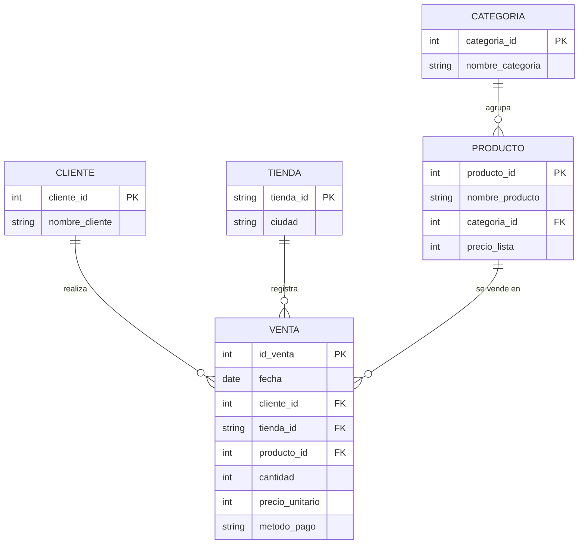

# Semana 4 (corte, sem 9) — ERD, limpieza con pandas y consultas

**Caso:** análisis de ventas de una cadena de tiendas de ropa con sedes en Neiva, Bogotá, Medellín y Cali.

| | |
|---|---|
| **Estudiante** | `FULL_NAME` |
| **Usuario GitHub** | `GITHUB_USER` |
| **Herramientas** | Python 3, pandas, SQLite |

## Índice

1. [Diseño del ERD](#1-diseño-del-erd-punto-1)
2. [Dataset y limpieza con pandas](#2-dataset-y-limpieza-con-pandas-punto-2)
3. [Preguntas con consultas](#3-preguntas-con-consultas-punto-3)
4. [Data & cleaning (English)](#data--cleaning)
5. [Cómo reproducirlo con solo este README](#cómo-reproducirlo-con-solo-este-readme)

---

## 1. Diseño del ERD (punto 1)

### Descripción del caso

La cadena quiere saber qué se vende, dónde y a quién. Cada **cliente** compra en una **tienda** uno o varios **productos**, y cada producto pertenece a una **categoría**. Cada fila de la tabla `VENTA` representa una línea de venta (un producto vendido, con su cantidad y precio en ese momento).

### Diagrama



### Entidades y atributos (5 entidades)

- **CLIENTE**: `cliente_id` (PK), `nombre_cliente`.
- **TIENDA**: `tienda_id` (PK), `ciudad`.
- **CATEGORIA**: `categoria_id` (PK), `nombre_categoria`.
- **PRODUCTO**: `producto_id` (PK), `nombre_producto`, `categoria_id` (FK), `precio_lista`.
- **VENTA**: `id_venta` (PK), `fecha`, `cliente_id` (FK), `tienda_id` (FK), `producto_id` (FK), `cantidad`, `precio_unitario`, `metodo_pago`.

### Relaciones y cardinalidad

| Relación | Cardinalidad | Explicación |
|---|---|---|
| CLIENTE — VENTA | **1 a N** (uno a muchos) | Un cliente puede tener muchas ventas; cada venta pertenece a un solo cliente. |
| TIENDA — VENTA | **1 a N** | Una tienda registra muchas ventas; cada venta se hace en una sola tienda. |
| PRODUCTO — VENTA | **1 a N** | Un producto aparece en muchas ventas; cada línea de venta corresponde a un solo producto. |
| CATEGORIA — PRODUCTO | **1 a N** | Una categoría agrupa muchos productos; cada producto tiene una sola categoría. |
| CLIENTE — PRODUCTO (indirecta) | **N a N** | Un cliente compra muchos productos y un producto lo compran muchos clientes. Se resuelve con la tabla intermedia `VENTA`. |

### Justificación del diseño

- **Normalización:** el nombre del cliente, la ciudad de la tienda y la categoría se guardan una sola vez y se referencian por llave foránea. Así se evita repetir datos y se reducen las inconsistencias (por ejemplo, "Neiva" escrita de tres formas distintas).
- **Integridad:** las llaves foráneas impiden registrar una venta de un cliente, tienda o producto que no existe.
- **`precio_unitario` en `VENTA`:** se guarda el precio al momento de la venta (aparte del `precio_lista` de `PRODUCTO`) para que el histórico no cambie si el precio del producto se modifica después.
- **Dataset plano:** el CSV de trabajo viene "aplanado" (una sola tabla con todas las columnas), como suele pasar al exportar de un sistema. El ERD muestra cómo quedaría organizado en una base relacional.

---

## 2. Dataset y limpieza con pandas (punto 2)

### 2.1 El dataset

Se trabajó con **`ventas_raw.csv`**, un dataset simulado de ventas de una cadena de tiendas de ropa: **315 filas y 11 columnas**.

| Columna | Qué guarda |
|---|---|
| `id_venta` | Identificador de la venta |
| `fecha` | Fecha de la venta |
| `cliente_id`, `nombre_cliente` | Cliente que compra |
| `ciudad`, `tienda_id` | Tienda donde se compra |
| `producto`, `categoria` | Producto vendido y su categoría |
| `cantidad`, `precio_unitario` | Unidades y precio de cada una (COP) |
| `metodo_pago` | Efectivo, Tarjeta o Transferencia |

El archivo se generó con el código de abajo (semilla fija, siempre da el mismo resultado) y trae **problemas de calidad a propósito**, como pasa con datos reales que vienen de varias fuentes. El dataset original completo está justo debajo (desplegable) y el limpio en la sección 2.6.

**Primeras 5 filas del dataset original:**

|   id_venta | fecha      |   cliente_id | nombre_cliente   | ciudad   | tienda_id   | producto             | categoria   |   cantidad | precio_unitario   | metodo_pago   |
|-----------:|:-----------|-------------:|:-----------------|:---------|:------------|:---------------------|:------------|-----------:|:------------------|:--------------|
|         74 | 01/02/2026 |           31 | Cliente 31       | Cali     | T04         | Sudadera             | Sudaderas   |          4 | 85000             | Efectivo      |
|        270 | 2026-05-22 |           21 | Cliente 21       | medellin | T03         | Chaqueta impermeable | Chaquetas   |          4 | 180000            | Transferencia |
|         31 | 2026-04-19 |           56 | Cliente 56       | BOGOTA   | T02         | Correa de cuero      | Accesorios  |          1 | 45.000            | Tarjeta       |
|         38 | 2026-07-18 |           21 | Cliente 21       | Medellin | T03         | Jean slim            | Pantalones  |          4 | 120000            | Tarjeta       |
|        169 | 2026-03-22 |           21 | Cliente 21       | cali     | T04         | Correa de cuero      | Accesorios  |          4 | $45.000           | Efectivo      |

<details>
<summary><b>Ver el código que genera el dataset (generar_dataset.py)</b></summary>

```python
"""Genera ventas_raw.csv: dataset simulado (con problemas de calidad a propósito)."""
import numpy as np
import pandas as pd

rng = np.random.default_rng(42)
N = 300

productos = {
    "Camiseta basica": ("Camisetas", 35000),
    "Jean slim": ("Pantalones", 120000),
    "Chaqueta impermeable": ("Chaquetas", 180000),
    "Vestido floral": ("Vestidos", 95000),
    "Sudadera": ("Sudaderas", 85000),
    "Gorra": ("Accesorios", 30000),
    "Correa de cuero": ("Accesorios", 45000),
}
tiendas = {"Neiva": "T01", "Bogota": "T02", "Medellin": "T03", "Cali": "T04"}
nombres = [f"Cliente {i:02d}" for i in range(1, 61)]
metodos = ["Efectivo", "Tarjeta", "Transferencia"]

rows = []
fechas = pd.to_datetime("2026-01-01") + pd.to_timedelta(rng.integers(0, 240, N), unit="D")
for i in range(N):
    prod = rng.choice(list(productos))
    cat, precio = productos[prod]
    cid = int(rng.integers(1, 61))
    ciudad = rng.choice(list(tiendas))
    rows.append({
        "id_venta": i + 1,
        "fecha": fechas[i],
        "cliente_id": cid,
        "nombre_cliente": nombres[cid - 1],
        "ciudad": ciudad,
        "tienda_id": tiendas[ciudad],
        "producto": prod,
        "categoria": cat,
        "cantidad": int(rng.integers(1, 5)),
        "precio_unitario": precio,
        "metodo_pago": rng.choice(metodos),
    })
df = pd.DataFrame(rows)

# --- Ensuciar los datos ---
# 1) Fechas en dos formatos
iso = rng.random(N) < 0.7
df["fecha"] = [d.strftime("%Y-%m-%d") if f else d.strftime("%d/%m/%Y") for d, f in zip(df["fecha"], iso)]
# 2) Ciudades con mayúsculas/espacios inconsistentes y tildes
def sucia(c):
    r = rng.random()
    return c.lower() if r < 0.2 else (c.upper() + " " if r < 0.35 else c)
df["ciudad"] = df["ciudad"].map(sucia)
# 3) Precios como texto con $ y separador de miles
def precio_txt(p):
    r = rng.random()
    return f"${p:,}".replace(",", ".") if r < 0.25 else (f"{p:,}".replace(",", ".") if r < 0.4 else str(p))
df["precio_unitario"] = df["precio_unitario"].map(precio_txt)
# 4) Nulos
for col, k in [("cantidad", 10), ("categoria", 15), ("nombre_cliente", 12), ("metodo_pago", 20), ("precio_unitario", 8)]:
    df[col] = df[col].astype(object)
    df.loc[rng.choice(N, k, replace=False), col] = np.nan
# 5) Cantidades inválidas (negativas)
df.loc[rng.choice(N, 2, replace=False), "cantidad"] = -1
# 6) Duplicados exactos
df = pd.concat([df, df.sample(15, random_state=1)], ignore_index=True)
df = df.sample(frac=1, random_state=7).reset_index(drop=True)
df.to_csv("ventas_raw.csv", index=False)
print("ventas_raw.csv generado:", df.shape)
```

</details>

<details>
<summary><b>Ver el dataset original completo (ventas_raw.csv, 315 filas)</b></summary>

```csv
id_venta,fecha,cliente_id,nombre_cliente,ciudad,tienda_id,producto,categoria,cantidad,precio_unitario,metodo_pago
74,01/02/2026,31,Cliente 31,Cali,T04,Sudadera,Sudaderas,4,85000,Efectivo
270,2026-05-22,21,Cliente 21,medellin,T03,Chaqueta impermeable,Chaquetas,4,180000,Transferencia
31,2026-04-19,56,Cliente 56,BOGOTA ,T02,Correa de cuero,Accesorios,1,45.000,Tarjeta
38,2026-07-18,21,Cliente 21,Medellin,T03,Jean slim,Pantalones,4,120000,Tarjeta
169,2026-03-22,21,Cliente 21,cali,T04,Correa de cuero,Accesorios,4,$45.000,Efectivo
71,2026-07-10,40,Cliente 40,Neiva,T01,Vestido floral,Vestidos,4,95000,Tarjeta
172,2026-01-22,8,Cliente 08,Cali,T04,Sudadera,Sudaderas,2,85000,Tarjeta
89,2026-07-04,46,Cliente 46,Medellin,T03,Gorra,Accesorios,2,30.000,Transferencia
281,08/03/2026,11,Cliente 11,Medellin,T03,Jean slim,Pantalones,1,$120.000,Transferencia
67,06/08/2026,20,Cliente 20,bogota,T02,Gorra,Accesorios,2,,Efectivo
156,2026-06-08,43,Cliente 43,neiva,T01,Jean slim,Pantalones,2,120000,
91,2026-04-15,9,Cliente 09,Neiva,T01,Correa de cuero,Accesorios,4,$45.000,Tarjeta
85,2026-06-01,56,Cliente 56,Cali,T04,Camiseta basica,Camisetas,1,35000,Transferencia
95,04/08/2026,60,Cliente 60,NEIVA ,T01,Sudadera,Sudaderas,3,85000,Transferencia
98,2026-06-13,2,Cliente 02,medellin,T03,Sudadera,Sudaderas,,$85.000,Efectivo
175,17/06/2026,38,Cliente 38,Bogota,T02,Sudadera,Sudaderas,1,85000,Efectivo
115,2026-05-02,13,Cliente 13,neiva,T01,Vestido floral,Vestidos,1,95000,Transferencia
160,08/07/2026,51,Cliente 51,cali,T04,Camiseta basica,Camisetas,1,$35.000,Tarjeta
291,2026-07-13,54,Cliente 54,medellin,T03,Correa de cuero,Accesorios,2,45000,Tarjeta
174,23/06/2026,2,Cliente 02,Bogota,T02,Camiseta basica,Camisetas,4,$35.000,Transferencia
300,06/01/2026,59,Cliente 59,Neiva,T01,Jean slim,Pantalones,2,120000,Tarjeta
235,29/04/2026,42,Cliente 42,BOGOTA ,T02,Correa de cuero,Accesorios,1,45000,Transferencia
74,01/02/2026,31,Cliente 31,Cali,T04,Sudadera,Sudaderas,4,85000,Efectivo
223,18/06/2026,34,Cliente 34,Bogota,T02,Camiseta basica,Camisetas,4,35000,Tarjeta
112,2026-07-07,15,Cliente 15,Neiva,T01,Gorra,Accesorios,3,30000,Transferencia
124,2026-04-24,33,Cliente 33,Cali,T04,Vestido floral,Vestidos,2,$95.000,
146,2026-07-24,5,Cliente 05,Bogota,T02,Camiseta basica,Camisetas,3,35000,Tarjeta
16,08/07/2026,45,Cliente 45,Medellin,T03,Camiseta basica,Camisetas,2,35.000,Efectivo
4,2026-04-16,44,Cliente 44,Medellin,T03,Sudadera,Sudaderas,4,85000,Transferencia
114,21/04/2026,50,Cliente 50,cali,T04,Sudadera,Sudaderas,2,85.000,Efectivo
254,2026-03-21,59,Cliente 59,Medellin,T03,Vestido floral,Vestidos,4,95000,Transferencia
200,2026-08-19,16,Cliente 16,Medellin,T03,Vestido floral,Vestidos,3,95000,Efectivo
61,2026-08-10,47,Cliente 47,medellin,T03,Sudadera,Sudaderas,1,85000,Transferencia
92,13/07/2026,45,Cliente 45,Bogota,T02,Vestido floral,Vestidos,1,$95.000,Transferencia
75,2026-06-14,37,Cliente 37,medellin,T03,Correa de cuero,Accesorios,1,$45.000,Tarjeta
15,22/06/2026,40,Cliente 40,BOGOTA ,T02,Chaqueta impermeable,Chaquetas,2,180000,Transferencia
128,2026-07-03,10,Cliente 10,Neiva,T01,Correa de cuero,,2,$45.000,Tarjeta
233,2026-01-05,19,Cliente 19,neiva,T01,Gorra,Accesorios,1,30000,Transferencia
164,2026-04-08,60,Cliente 60,medellin,T03,Vestido floral,Vestidos,3,$95.000,Tarjeta
295,11/05/2026,23,Cliente 23,Bogota,T02,Chaqueta impermeable,Chaquetas,2,180000,Transferencia
274,19/08/2026,46,Cliente 46,Medellin,T03,Chaqueta impermeable,Chaquetas,3,180000,Transferencia
103,2026-07-13,53,Cliente 53,Medellin,T03,Camiseta basica,Camisetas,2,35000,Transferencia
285,2026-04-16,45,Cliente 45,Medellin,T03,Camiseta basica,Camisetas,3,$35.000,Tarjeta
3,2026-06-07,41,Cliente 41,Neiva,T01,Sudadera,Sudaderas,2,85.000,Efectivo
149,17/07/2026,52,,Bogota,T02,Sudadera,Sudaderas,2,85000,Transferencia
289,2026-05-11,45,,Bogota,T02,Vestido floral,Vestidos,1,95000,
100,2026-02-03,59,Cliente 59,Bogota,T02,Chaqueta impermeable,Chaquetas,2,180.000,Tarjeta
280,2026-01-20,29,Cliente 29,Neiva,T01,Sudadera,Sudaderas,2,85000,
127,20/01/2026,42,Cliente 42,Bogota,T02,Vestido floral,Vestidos,3,95.000,Tarjeta
133,2026-01-22,25,Cliente 25,Cali,T04,Jean slim,Pantalones,1,120000,Transferencia
81,14/08/2026,37,Cliente 37,Neiva,T01,Vestido floral,Vestidos,1,95000,Efectivo
267,18/04/2026,54,Cliente 54,Neiva,T01,Sudadera,Sudaderas,4,85000,Tarjeta
171,26/01/2026,31,Cliente 31,bogota,T02,Chaqueta impermeable,Chaquetas,4,180.000,Efectivo
185,29/04/2026,34,Cliente 34,Cali,T04,Sudadera,Sudaderas,,$85.000,Tarjeta
140,2026-04-15,32,Cliente 32,Bogota,T02,Sudadera,Sudaderas,4,85000,Tarjeta
102,2026-02-17,33,Cliente 33,Neiva,T01,Gorra,Accesorios,2,$30.000,Transferencia
189,2026-02-27,47,Cliente 47,Cali,T04,Vestido floral,Vestidos,2,95000,Transferencia
232,2026-07-25,60,Cliente 60,Bogota,T02,Camiseta basica,Camisetas,2,$35.000,Tarjeta
178,2026-02-08,9,Cliente 09,Medellin,T03,Chaqueta impermeable,Chaquetas,3,180000,Efectivo
66,2026-03-20,21,Cliente 21,Bogota,T02,Jean slim,Pantalones,3,120000,Tarjeta
82,15/04/2026,1,Cliente 01,Medellin,T03,Vestido floral,Vestidos,2,95.000,Tarjeta
58,2026-02-07,42,Cliente 42,Neiva,T01,Correa de cuero,Accesorios,4,45000,Transferencia
207,2026-07-03,44,Cliente 44,Bogota,T02,Vestido floral,Vestidos,,$95.000,Tarjeta
294,21/03/2026,31,Cliente 31,Bogota,T02,Correa de cuero,Accesorios,1,,Efectivo
87,2026-01-24,26,Cliente 26,Cali,T04,Gorra,Accesorios,4,30.000,Efectivo
19,2026-07-21,11,Cliente 11,Bogota,T02,Gorra,Accesorios,3,$30.000,Transferencia
90,19/07/2026,32,Cliente 32,Bogota,T02,Chaqueta impermeable,Chaquetas,2,$180.000,Efectivo
177,2026-06-22,56,Cliente 56,Medellin,T03,Sudadera,Sudaderas,2,85000,Tarjeta
247,01/07/2026,1,Cliente 01,Cali,T04,Camiseta basica,Camisetas,1,35000,Transferencia
56,11/01/2026,56,Cliente 56,Medellin,T03,Chaqueta impermeable,Chaquetas,4,180000,Efectivo
130,2026-06-02,59,Cliente 59,neiva,T01,Camiseta basica,Camisetas,,35000,Efectivo
228,2026-05-20,26,Cliente 26,medellin,T03,Camiseta basica,Camisetas,2,35000,Transferencia
208,2026-08-21,39,Cliente 39,bogota,T02,Correa de cuero,Accesorios,4,45000,Tarjeta
277,2026-04-23,1,Cliente 01,Neiva,T01,Correa de cuero,Accesorios,4,45000,Tarjeta
246,2026-01-21,20,Cliente 20,Neiva,T01,Camiseta basica,,1,35000,Transferencia
126,2026-05-16,33,Cliente 33,Bogota,T02,Correa de cuero,Accesorios,2,45000,Tarjeta
23,2026-02-13,14,Cliente 14,Bogota,T02,Jean slim,Pantalones,1,120000,Efectivo
119,2026-02-28,43,Cliente 43,Medellin,T03,Camiseta basica,Camisetas,4,35000,Transferencia
218,24/01/2026,34,Cliente 34,Bogota,T02,Jean slim,Pantalones,4,120000,Transferencia
211,2026-03-04,24,Cliente 24,Bogota,T02,Camiseta basica,Camisetas,4,35000,Efectivo
288,18/05/2026,31,Cliente 31,Neiva,T01,Gorra,Accesorios,1,30000,Efectivo
296,2026-05-05,20,Cliente 20,Neiva,T01,Camiseta basica,Camisetas,2,35.000,Transferencia
123,07/06/2026,12,Cliente 12,bogota,T02,Gorra,Accesorios,4,30000,Tarjeta
275,2026-04-11,35,,Bogota,T02,Gorra,Accesorios,4,30000,Transferencia
203,29/04/2026,21,Cliente 21,Cali,T04,Vestido floral,Vestidos,,95.000,Transferencia
186,18/04/2026,7,Cliente 07,cali,T04,Correa de cuero,Accesorios,1,$45.000,Efectivo
266,20/05/2026,35,Cliente 35,Medellin,T03,Correa de cuero,Accesorios,2,$45.000,Efectivo
268,2026-03-25,10,Cliente 10,MEDELLIN ,T03,Vestido floral,Vestidos,1,$95.000,Efectivo
116,2026-05-17,33,Cliente 33,Medellin,T03,Vestido floral,Vestidos,3,$95.000,Tarjeta
109,24/04/2026,40,Cliente 40,cali,T04,Chaqueta impermeable,Chaquetas,1,180000,Efectivo
243,23/01/2026,14,Cliente 14,medellin,T03,Chaqueta impermeable,,2,$180.000,Efectivo
300,06/01/2026,59,Cliente 59,Neiva,T01,Jean slim,Pantalones,2,120000,Tarjeta
25,2026-07-07,42,Cliente 42,cali,T04,Correa de cuero,,3,45000,Tarjeta
105,2026-07-11,40,Cliente 40,Neiva,T01,Camiseta basica,Camisetas,3,,
263,13/03/2026,9,Cliente 09,medellin,T03,Gorra,Accesorios,3,$30.000,Efectivo
162,2026-06-09,15,Cliente 15,Cali,T04,Jean slim,Pantalones,4,120000,Efectivo
63,2026-03-29,28,Cliente 28,CALI ,T04,Gorra,Accesorios,2,30000,
284,2026-04-28,39,Cliente 39,BOGOTA ,T02,Correa de cuero,Accesorios,2,$45.000,Tarjeta
79,2026-05-16,48,Cliente 48,Cali,T04,Correa de cuero,Accesorios,4,45000,Efectivo
267,18/04/2026,54,Cliente 54,Neiva,T01,Sudadera,Sudaderas,4,85000,Tarjeta
51,2026-07-02,24,Cliente 24,cali,T04,Gorra,Accesorios,2,$30.000,
139,2026-03-25,33,Cliente 33,Neiva,T01,Chaqueta impermeable,Chaquetas,2,$180.000,Tarjeta
231,22/04/2026,3,Cliente 03,Neiva,T01,Chaqueta impermeable,Chaquetas,1,180000,Tarjeta
264,2026-08-11,48,Cliente 48,MEDELLIN ,T03,Jean slim,Pantalones,1,$120.000,Transferencia
151,2026-07-25,22,Cliente 22,Medellin,T03,Vestido floral,Vestidos,4,95.000,Efectivo
53,2026-03-29,3,Cliente 03,bogota,T02,Vestido floral,Vestidos,1,95.000,Transferencia
265,2026-08-26,1,Cliente 01,Cali,T04,Jean slim,Pantalones,1,$120.000,Tarjeta
62,2026-06-28,20,Cliente 20,Medellin,T03,Vestido floral,Vestidos,4,95000,Transferencia
59,2026-06-28,55,Cliente 55,Neiva,T01,Gorra,Accesorios,4,30000,Efectivo
239,2026-03-16,30,Cliente 30,Neiva,T01,Jean slim,Pantalones,2,,Tarjeta
214,18/04/2026,19,,Bogota,T02,Camiseta basica,Camisetas,4,35000,Tarjeta
29,2026-05-11,19,Cliente 19,Neiva,T01,Correa de cuero,Accesorios,2,$45.000,Tarjeta
70,2026-04-23,28,Cliente 28,Medellin,T03,Chaqueta impermeable,,4,180000,Transferencia
37,25/07/2026,50,Cliente 50,BOGOTA ,T02,Chaqueta impermeable,Chaquetas,4,180000,Tarjeta
41,2026-02-09,40,Cliente 40,Cali,T04,Camiseta basica,Camisetas,4,35000,Efectivo
161,28/08/2026,29,Cliente 29,Cali,T04,Vestido floral,Vestidos,1,$95.000,Efectivo
259,2026-02-12,21,Cliente 21,Bogota,T02,Gorra,Accesorios,1,30000,Transferencia
12,23/08/2026,10,Cliente 10,Cali,T04,Correa de cuero,,1,$45.000,Transferencia
155,2026-04-15,13,Cliente 13,Cali,T04,Sudadera,Sudaderas,3,85000,Tarjeta
17,2026-05-04,57,Cliente 57,CALI ,T04,Camiseta basica,Camisetas,1,$35.000,Efectivo
262,2026-02-10,9,Cliente 09,Medellin,T03,Correa de cuero,Accesorios,1,$45.000,Efectivo
221,2026-01-31,15,Cliente 15,Bogota,T02,Gorra,Accesorios,2,$30.000,
213,2026-07-09,5,Cliente 05,Bogota,T02,Camiseta basica,Camisetas,1,35000,Tarjeta
142,2026-02-21,52,Cliente 52,Medellin,T03,Correa de cuero,Accesorios,3,$45.000,Tarjeta
99,02/06/2026,28,Cliente 28,Medellin,T03,Camiseta basica,Camisetas,4,35000,Tarjeta
180,2026-05-01,43,Cliente 43,Cali,T04,Sudadera,Sudaderas,4,85000,Tarjeta
47,17/04/2026,10,Cliente 10,Neiva,T01,Sudadera,Sudaderas,2,$85.000,Tarjeta
148,26/02/2026,55,Cliente 55,Neiva,T01,Gorra,Accesorios,2,30000,Transferencia
238,2026-04-14,10,Cliente 10,Neiva,T01,Correa de cuero,Accesorios,1,$45.000,Tarjeta
129,18/05/2026,25,Cliente 25,CALI ,T04,Sudadera,Sudaderas,2,$85.000,Efectivo
8,2026-06-17,58,Cliente 58,Bogota,T02,Gorra,Accesorios,1,30000,Transferencia
298,2026-04-16,12,Cliente 12,Neiva,T01,Jean slim,Pantalones,2,120.000,Transferencia
154,2026-03-12,56,Cliente 56,MEDELLIN ,T03,Chaqueta impermeable,Chaquetas,2,$180.000,Efectivo
224,2026-02-18,39,Cliente 39,Bogota,T02,Gorra,Accesorios,4,30000,Tarjeta
215,26/06/2026,21,Cliente 21,bogota,T02,Correa de cuero,Accesorios,2,45.000,Transferencia
9,2026-02-18,18,Cliente 18,MEDELLIN ,T03,Sudadera,Sudaderas,3,$85.000,Transferencia
28,17/07/2026,35,Cliente 35,Cali,T04,Camiseta basica,Camisetas,1,35000,Tarjeta
279,2026-01-16,54,Cliente 54,Medellin,T03,Gorra,Accesorios,2,30.000,Efectivo
59,2026-06-28,55,Cliente 55,Neiva,T01,Gorra,Accesorios,4,30000,Efectivo
217,2026-01-20,18,Cliente 18,Bogota,T02,Correa de cuero,,4,45.000,Tarjeta
214,18/04/2026,19,,Bogota,T02,Camiseta basica,Camisetas,4,35000,Tarjeta
242,21/05/2026,55,Cliente 55,bogota,T02,Jean slim,Pantalones,4,$120.000,Transferencia
209,05/03/2026,9,Cliente 09,Neiva,T01,Vestido floral,Vestidos,3,95000,Efectivo
32,2026-02-24,9,Cliente 09,Medellin,T03,Vestido floral,Vestidos,4,$95.000,
2,2026-07-05,19,Cliente 19,Medellin,T03,Camiseta basica,Camisetas,2,35000,Efectivo
173,2026-07-05,30,Cliente 30,Cali,T04,Sudadera,Sudaderas,3,85000,Tarjeta
14,02/07/2026,29,Cliente 29,Bogota,T02,Vestido floral,Vestidos,1,95000,Transferencia
10,2026-01-23,60,Cliente 60,Cali,T04,Jean slim,Pantalones,1,120000,
147,2026-01-09,11,Cliente 11,Medellin,T03,Vestido floral,Vestidos,2,95.000,Efectivo
293,17/08/2026,25,Cliente 25,Neiva,T01,Chaqueta impermeable,Chaquetas,3,$180.000,Tarjeta
96,2026-03-11,26,Cliente 26,Neiva,T01,Correa de cuero,,2,45000,Transferencia
35,02/08/2026,49,,BOGOTA ,T02,Gorra,Accesorios,2,$30.000,Tarjeta
97,2026-02-27,39,Cliente 39,neiva,T01,Correa de cuero,Accesorios,1,$45.000,Tarjeta
128,2026-07-03,10,Cliente 10,Neiva,T01,Correa de cuero,,2,$45.000,Tarjeta
194,2026-03-28,4,Cliente 04,bogota,T02,Camiseta basica,Camisetas,4,35000,Efectivo
182,06/02/2026,31,Cliente 31,medellin,T03,Correa de cuero,Accesorios,2,45000,Transferencia
249,2026-07-08,15,Cliente 15,Neiva,T01,Vestido floral,Vestidos,3,95000,Efectivo
290,2026-04-24,60,Cliente 60,Bogota,T02,Correa de cuero,Accesorios,4,$45.000,Transferencia
46,2026-08-21,56,Cliente 56,NEIVA ,T01,Chaqueta impermeable,Chaquetas,,180.000,
222,2026-04-20,21,Cliente 21,Cali,T04,Jean slim,Pantalones,1,$120.000,Efectivo
33,2026-01-23,9,Cliente 09,medellin,T03,Gorra,Accesorios,-1,30000,Efectivo
78,2026-02-24,25,Cliente 25,medellin,T03,Gorra,Accesorios,2,30000,Transferencia
243,23/01/2026,14,Cliente 14,medellin,T03,Chaqueta impermeable,,2,$180.000,Efectivo
134,15/05/2026,37,Cliente 37,Bogota,T02,Sudadera,Sudaderas,4,85000,Efectivo
145,2026-08-27,5,Cliente 05,Cali,T04,Camiseta basica,Camisetas,4,$35.000,Transferencia
157,31/01/2026,60,Cliente 60,Cali,T04,Correa de cuero,Accesorios,3,$45.000,Efectivo
64,2026-08-21,15,Cliente 15,Bogota,T02,Sudadera,Sudaderas,1,85000,Efectivo
83,08/02/2026,32,Cliente 32,Medellin,T03,Sudadera,Sudaderas,4,85000,Transferencia
244,05/06/2026,29,Cliente 29,neiva,T01,Correa de cuero,Accesorios,2,45000,Tarjeta
236,2026-06-22,30,Cliente 30,Bogota,T02,Chaqueta impermeable,Chaquetas,1,180000,Tarjeta
245,2026-05-31,43,Cliente 43,neiva,T01,Correa de cuero,Accesorios,1,45000,Tarjeta
42,01/07/2026,32,Cliente 32,NEIVA ,T01,Vestido floral,Vestidos,2,$95.000,Efectivo
283,2026-06-11,29,Cliente 29,Cali,T04,Chaqueta impermeable,Chaquetas,3,180.000,Tarjeta
165,2026-04-11,6,Cliente 06,Bogota,T02,Camiseta basica,Camisetas,1,35000,Transferencia
110,2026-06-19,10,Cliente 10,Neiva,T01,Camiseta basica,Camisetas,4,35000,Tarjeta
187,09/02/2026,45,Cliente 45,Cali,T04,Gorra,Accesorios,3,30000,Tarjeta
229,2026-05-12,31,Cliente 31,Cali,T04,Gorra,,2,$30.000,Efectivo
122,10/06/2026,25,Cliente 25,Neiva,T01,Sudadera,Sudaderas,2,85000,Efectivo
52,2026-02-16,45,Cliente 45,cali,T04,Vestido floral,Vestidos,4,95000,Transferencia
57,12/05/2026,51,Cliente 51,Neiva,T01,Camiseta basica,Camisetas,1,35000,Tarjeta
255,2026-06-08,22,Cliente 22,MEDELLIN ,T03,Camiseta basica,Camisetas,4,35.000,Efectivo
159,2026-05-02,27,Cliente 27,Cali,T04,Vestido floral,Vestidos,2,95.000,Efectivo
86,18/06/2026,44,Cliente 44,Neiva,T01,Camiseta basica,Camisetas,2,,Tarjeta
121,16/04/2026,3,,Neiva,T01,Camiseta basica,Camisetas,4,$35.000,
299,2026-03-10,53,Cliente 53,BOGOTA ,T02,Sudadera,Sudaderas,2,85000,Tarjeta
190,2026-03-14,52,Cliente 52,bogota,T02,Correa de cuero,Accesorios,2,45.000,Transferencia
195,2026-08-19,7,Cliente 07,Cali,T04,Chaqueta impermeable,Chaquetas,3,180000,Transferencia
241,2026-02-03,16,Cliente 16,NEIVA ,T01,Vestido floral,Vestidos,2,$95.000,Tarjeta
271,2026-03-12,2,Cliente 02,Neiva,T01,Jean slim,Pantalones,3,120000,Efectivo
88,2026-03-16,44,Cliente 44,BOGOTA ,T02,Sudadera,Sudaderas,3,85000,Transferencia
166,15/07/2026,52,Cliente 52,Medellin,T03,Gorra,Accesorios,3,30000,
123,07/06/2026,12,Cliente 12,bogota,T02,Gorra,Accesorios,4,30000,Tarjeta
286,14/08/2026,57,Cliente 57,medellin,T03,Gorra,,2,30000,Efectivo
106,2026-07-08,41,Cliente 41,Cali,T04,Camiseta basica,Camisetas,4,,Efectivo
292,2026-03-06,21,Cliente 21,Medellin,T03,Chaqueta impermeable,Chaquetas,3,180.000,Tarjeta
183,30/04/2026,47,Cliente 47,Bogota,T02,Sudadera,Sudaderas,4,85000,Efectivo
50,2026-07-06,26,Cliente 26,Medellin,T03,Camiseta basica,Camisetas,3,35.000,Transferencia
227,2026-07-14,12,Cliente 12,neiva,T01,Vestido floral,Vestidos,3,95.000,Efectivo
6,2026-07-26,15,Cliente 15,neiva,T01,Jean slim,Pantalones,1,120000,Tarjeta
18,2026-01-31,5,Cliente 05,Cali,T04,Camiseta basica,Camisetas,4,35000,Efectivo
256,2026-02-04,33,Cliente 33,cali,T04,Chaqueta impermeable,Chaquetas,1,180000,Tarjeta
117,2026-01-09,52,Cliente 52,Bogota,T02,Camiseta basica,Camisetas,1,$35.000,Transferencia
250,10/01/2026,42,Cliente 42,CALI ,T04,Sudadera,,2,85000,Efectivo
107,07/07/2026,15,Cliente 15,Bogota,T02,Jean slim,Pantalones,1,120000,Transferencia
188,02/04/2026,1,Cliente 01,NEIVA ,T01,Chaqueta impermeable,Chaquetas,2,180000,Efectivo
163,2026-04-09,14,Cliente 14,Neiva,T01,Sudadera,,2,85000,Efectivo
135,2026-07-10,26,Cliente 26,Bogota,T02,Chaqueta impermeable,Chaquetas,2,180000,Efectivo
257,2026-06-12,13,Cliente 13,MEDELLIN ,T03,Chaqueta impermeable,Chaquetas,2,$180.000,Tarjeta
191,2026-06-14,25,Cliente 25,Neiva,T01,Jean slim,Pantalones,4,120000,Tarjeta
65,09/04/2026,29,Cliente 29,Neiva,T01,Vestido floral,,2,95000,Tarjeta
27,2026-04-07,45,Cliente 45,Cali,T04,Camiseta basica,Camisetas,1,35.000,
226,2026-03-15,41,Cliente 41,Cali,T04,Gorra,,2,$30.000,Transferencia
170,2026-01-06,32,Cliente 32,CALI ,T04,Vestido floral,Vestidos,3,95000,Transferencia
181,2026-08-14,29,Cliente 29,Cali,T04,Correa de cuero,Accesorios,4,45000,Tarjeta
101,2026-07-19,19,,MEDELLIN ,T03,Camiseta basica,Camisetas,4,35000,Transferencia
198,29/01/2026,55,,Neiva,T01,Camiseta basica,Camisetas,1,35000,Tarjeta
210,2026-07-06,52,Cliente 52,Medellin,T03,Correa de cuero,Accesorios,3,45.000,Tarjeta
136,2026-03-14,6,Cliente 06,Medellin,T03,Jean slim,Pantalones,2,120000,Tarjeta
297,2026-07-23,21,Cliente 21,Neiva,T01,Camiseta basica,Camisetas,-1,35000,Transferencia
273,2026-02-06,37,Cliente 37,neiva,T01,Sudadera,Sudaderas,,85000,Tarjeta
199,23/03/2026,52,Cliente 52,Bogota,T02,Jean slim,Pantalones,1,120000,Transferencia
118,03/02/2026,4,Cliente 04,neiva,T01,Gorra,Accesorios,1,30000,Efectivo
167,2026-03-19,41,Cliente 41,CALI ,T04,Chaqueta impermeable,Chaquetas,4,180000,Tarjeta
237,2026-06-09,1,Cliente 01,BOGOTA ,T02,Jean slim,Pantalones,1,120000,Tarjeta
137,2026-05-25,43,Cliente 43,medellin,T03,Sudadera,Sudaderas,3,85000,Tarjeta
30,17/04/2026,19,Cliente 19,cali,T04,Sudadera,Sudaderas,3,85.000,Efectivo
80,2026-06-10,44,Cliente 44,Medellin,T03,Jean slim,Pantalones,1,120000,Efectivo
205,2026-04-20,17,Cliente 17,medellin,T03,Camiseta basica,Camisetas,4,35000,Transferencia
141,2026-08-24,45,Cliente 45,medellin,T03,Gorra,Accesorios,4,30000,Efectivo
158,2026-05-14,49,Cliente 49,Cali,T04,Gorra,Accesorios,3,30000,Efectivo
132,13/05/2026,25,Cliente 25,Medellin,T03,Sudadera,Sudaderas,4,85000,Tarjeta
40,2026-06-01,8,Cliente 08,bogota,T02,Chaqueta impermeable,Chaquetas,,180000,Tarjeta
179,2026-08-05,17,Cliente 17,Neiva,T01,Chaqueta impermeable,Chaquetas,,180000,Tarjeta
206,05/03/2026,41,Cliente 41,NEIVA ,T01,Jean slim,Pantalones,3,120000,
216,2026-03-07,58,Cliente 58,Cali,T04,Correa de cuero,Accesorios,3,,Tarjeta
240,2026-05-31,34,Cliente 34,Cali,T04,Vestido floral,Vestidos,2,95000,Transferencia
55,30/04/2026,25,Cliente 25,bogota,T02,Correa de cuero,Accesorios,1,$45.000,Efectivo
107,07/07/2026,15,Cliente 15,Bogota,T02,Jean slim,Pantalones,1,120000,Transferencia
201,2026-03-29,25,Cliente 25,Medellin,T03,Gorra,Accesorios,4,30000,Tarjeta
44,2026-03-27,53,Cliente 53,neiva,T01,Camiseta basica,Camisetas,2,$35.000,Tarjeta
269,27/05/2026,4,Cliente 04,Bogota,T02,Gorra,Accesorios,3,$30.000,Efectivo
49,12/06/2026,4,Cliente 04,Neiva,T01,Sudadera,Sudaderas,1,85.000,Transferencia
36,2026-01-16,51,Cliente 51,neiva,T01,Gorra,Accesorios,3,30000,Efectivo
60,2026-06-13,35,Cliente 35,Cali,T04,Gorra,Accesorios,3,30000,Tarjeta
144,2026-04-09,24,Cliente 24,Bogota,T02,Gorra,Accesorios,1,$30.000,Efectivo
54,2026-04-23,14,Cliente 14,Neiva,T01,Jean slim,Pantalones,3,120.000,Tarjeta
21,2026-05-01,47,,bogota,T02,Correa de cuero,Accesorios,4,45.000,Tarjeta
125,2026-07-25,35,Cliente 35,BOGOTA ,T02,Correa de cuero,Accesorios,1,45.000,Efectivo
143,2026-03-08,48,,Neiva,T01,Jean slim,Pantalones,2,120000,Tarjeta
111,2026-03-08,49,Cliente 49,Cali,T04,Correa de cuero,Accesorios,1,45.000,Efectivo
260,22/05/2026,40,Cliente 40,Medellin,T03,Jean slim,Pantalones,4,120000,Transferencia
77,2026-03-21,9,Cliente 09,cali,T04,Gorra,Accesorios,4,30000,Efectivo
287,2026-02-08,55,Cliente 55,Medellin,T03,Gorra,Accesorios,4,30.000,
278,2026-07-07,26,Cliente 26,Bogota,T02,Vestido floral,Vestidos,4,95000,Efectivo
108,2026-06-09,49,Cliente 49,Neiva,T01,Gorra,Accesorios,1,30.000,Transferencia
94,2026-04-03,37,Cliente 37,BOGOTA ,T02,Gorra,Accesorios,1,30000,Tarjeta
13,26/06/2026,54,Cliente 54,Neiva,T01,Gorra,Accesorios,4,30000,Efectivo
48,03/08/2026,28,Cliente 28,NEIVA ,T01,Jean slim,Pantalones,3,120000,Efectivo
204,17/06/2026,43,Cliente 43,MEDELLIN ,T03,Chaqueta impermeable,Chaquetas,2,180000,Tarjeta
272,06/01/2026,51,Cliente 51,cali,T04,Jean slim,Pantalones,4,120000,Efectivo
120,2026-01-28,31,Cliente 31,Neiva,T01,Sudadera,Sudaderas,1,$85.000,Tarjeta
22,30/03/2026,27,Cliente 27,NEIVA ,T01,Vestido floral,Vestidos,4,95000,Efectivo
84,2026-07-19,32,Cliente 32,Bogota,T02,Gorra,Accesorios,1,30.000,Tarjeta
131,2026-05-16,19,Cliente 19,Medellin,T03,Camiseta basica,Camisetas,2,35000,Transferencia
230,12/02/2026,57,Cliente 57,Cali,T04,Camiseta basica,Camisetas,3,35.000,Efectivo
276,26/04/2026,9,Cliente 09,Bogota,T02,Correa de cuero,Accesorios,4,45000,Tarjeta
124,2026-04-24,33,Cliente 33,Cali,T04,Vestido floral,Vestidos,2,$95.000,
34,14/05/2026,10,Cliente 10,Medellin,T03,Correa de cuero,Accesorios,1,45000,Transferencia
5,14/04/2026,7,Cliente 07,medellin,T03,Chaqueta impermeable,Chaquetas,4,180000,Transferencia
20,2026-04-19,3,Cliente 03,neiva,T01,Correa de cuero,Accesorios,2,$45.000,Efectivo
220,05/08/2026,38,Cliente 38,Medellin,T03,Sudadera,Sudaderas,1,85000,Efectivo
148,26/02/2026,55,Cliente 55,Neiva,T01,Gorra,Accesorios,2,30000,Transferencia
150,2026-01-14,15,Cliente 15,medellin,T03,Jean slim,Pantalones,3,120000,Efectivo
225,2026-06-23,60,Cliente 60,Medellin,T03,Correa de cuero,Accesorios,3,45000,Efectivo
248,10/04/2026,10,Cliente 10,Neiva,T01,Camiseta basica,Camisetas,3,35000,Tarjeta
282,2026-04-27,60,Cliente 60,cali,T04,Correa de cuero,Accesorios,1,45000,Efectivo
152,2026-03-09,27,,Cali,T04,Correa de cuero,Accesorios,2,45.000,Efectivo
234,02/07/2026,39,Cliente 39,bogota,T02,Camiseta basica,Camisetas,4,35.000,Efectivo
11,07/05/2026,3,Cliente 03,Bogota,T02,Vestido floral,Vestidos,2,$95.000,Transferencia
72,2026-02-15,46,Cliente 46,Medellin,T03,Vestido floral,Vestidos,1,95000,Efectivo
253,2026-02-15,16,Cliente 16,Neiva,T01,Chaqueta impermeable,Chaquetas,4,180000,Tarjeta
93,22/07/2026,34,Cliente 34,Cali,T04,Jean slim,Pantalones,4,120000,Tarjeta
193,2026-05-26,56,Cliente 56,bogota,T02,Jean slim,Pantalones,4,$120.000,Efectivo
258,2026-01-25,50,Cliente 50,Neiva,T01,Chaqueta impermeable,Chaquetas,4,180000,Efectivo
177,2026-06-22,56,Cliente 56,Medellin,T03,Sudadera,Sudaderas,2,85000,Tarjeta
196,2026-01-22,40,Cliente 40,cali,T04,Sudadera,Sudaderas,1,85000,Transferencia
138,2026-01-08,37,Cliente 37,Bogota,T02,Sudadera,,1,85000,Transferencia
261,2026-07-10,45,Cliente 45,Cali,T04,Chaqueta impermeable,Chaquetas,2,180.000,Efectivo
39,08/03/2026,53,Cliente 53,cali,T04,Correa de cuero,Accesorios,3,45000,Efectivo
202,2026-08-07,16,Cliente 16,neiva,T01,Sudadera,Sudaderas,2,85000,Transferencia
190,2026-03-14,52,Cliente 52,bogota,T02,Correa de cuero,Accesorios,2,45.000,Transferencia
252,29/04/2026,54,Cliente 54,Cali,T04,Jean slim,Pantalones,4,$120.000,Transferencia
113,2026-05-14,56,Cliente 56,Neiva,T01,Correa de cuero,Accesorios,4,45000,Transferencia
184,17/06/2026,31,Cliente 31,Medellin,T03,Camiseta basica,Camisetas,,35.000,
153,2026-08-09,42,,NEIVA ,T01,Gorra,Accesorios,3,30.000,Transferencia
192,2026-06-01,14,Cliente 14,Medellin,T03,Camiseta basica,Camisetas,3,35000,Transferencia
45,2026-01-17,9,Cliente 09,Neiva,T01,Chaqueta impermeable,Chaquetas,4,180000,Efectivo
276,26/04/2026,9,Cliente 09,Bogota,T02,Correa de cuero,Accesorios,4,45000,Tarjeta
7,2026-01-21,23,Cliente 23,Bogota,T02,Vestido floral,Vestidos,4,95000,Tarjeta
251,2026-02-13,52,Cliente 52,Medellin,T03,Jean slim,Pantalones,3,120000,Tarjeta
76,2026-04-25,35,Cliente 35,NEIVA ,T01,Gorra,Accesorios,3,,Transferencia
1,2026-01-22,50,Cliente 50,Neiva,T01,Chaqueta impermeable,Chaquetas,4,180000,
69,2026-01-19,55,Cliente 55,Cali,T04,Sudadera,Sudaderas,2,85000,Transferencia
168,2026-02-10,44,Cliente 44,bogota,T02,Camiseta basica,Camisetas,3,$35.000,
219,2026-04-18,32,Cliente 32,Cali,T04,Chaqueta impermeable,Chaquetas,3,180000,Efectivo
43,2026-06-18,45,Cliente 45,Cali,T04,Correa de cuero,Accesorios,4,45.000,Transferencia
73,2026-04-22,45,Cliente 45,Neiva,T01,Jean slim,Pantalones,1,120000,Tarjeta
24,2026-08-11,59,Cliente 59,Neiva,T01,Sudadera,Sudaderas,2,85000,Tarjeta
186,18/04/2026,7,Cliente 07,cali,T04,Correa de cuero,Accesorios,1,$45.000,Efectivo
104,2026-01-02,3,Cliente 03,NEIVA ,T01,Gorra,Accesorios,3,30000,Transferencia
212,2026-06-22,21,Cliente 21,Neiva,T01,Vestido floral,Vestidos,1,95.000,
68,2026-03-30,15,Cliente 15,Bogota,T02,Sudadera,Sudaderas,4,$85.000,Transferencia
26,2026-06-04,52,Cliente 52,Cali,T04,Jean slim,Pantalones,1,$120.000,Transferencia
197,2026-03-24,45,Cliente 45,Bogota,T02,Gorra,Accesorios,4,$30.000,Tarjeta
176,2026-04-21,19,Cliente 19,neiva,T01,Chaqueta impermeable,Chaquetas,2,180000,Efectivo
```

</details>

### 2.2 Ejemplos de datos sucios (ANTES)

Una fila real del archivo por cada tipo de problema:

| Problema                        |   id_venta | fecha      |   cliente_id | ciudad   | producto             | categoria   |   cantidad | precio_unitario   | metodo_pago   |
|:--------------------------------|-----------:|:-----------|-------------:|:---------|:---------------------|:------------|-----------:|:------------------|:--------------|
| Fila duplicada                  |         74 | 01/02/2026 |           31 | Cali     | Sudadera             | Sudaderas   |          4 | 85000             | Efectivo      |
| Ciudad en minúscula             |        270 | 2026-05-22 |           21 | medellin | Chaqueta impermeable | Chaquetas   |          4 | 180000            | Transferencia |
| Ciudad con espacio y mayúsculas |         31 | 2026-04-19 |           56 | BOGOTA   | Correa de cuero      | Accesorios  |          1 | 45.000            | Tarjeta       |
| Fecha en formato dd/mm/aaaa     | 281 | 08/03/2026 | 11 | Medellin | Jean slim | Pantalones | 1 | $120.000 | Transferencia |
| Precio con $ y punto            |        169 | 2026-03-22 |           21 | cali     | Correa de cuero      | Accesorios  |          4 | $45.000           | Efectivo      |
| Cantidad nula                   |         98 | 2026-06-13 |            2 | medellin | Sudadera             | Sudaderas   |        NaN | $85.000           | Efectivo      |
| Cantidad negativa               |         33 | 2026-01-23 |            9 | medellin | Gorra                | Accesorios  |         -1 | 30000             | Efectivo      |
| Categoría nula                  |        128 | 2026-07-03 |           10 | Neiva    | Correa de cuero      | NaN         |          2 | $45.000           | Tarjeta       |
| Método de pago nulo             |        156 | 2026-06-08 |           43 | neiva    | Jean slim            | Pantalones  |          2 | 120000            | NaN           |

### 2.3 Problemas encontrados y cómo se trató cada uno

| # | Problema | Cómo se detectó | Tratamiento |
|---|---|---|---|
| 1 | **Duplicados exactos** (15 filas) | `df.duplicated().sum()` | `drop_duplicates()` |
| 2 | **Ciudades inconsistentes**: 12 variantes para 4 ciudades (`neiva`, `NEIVA `, `Neiva`...) | `df["ciudad"].nunique()` | `str.strip().str.title()` → quedan 4 |
| 3 | **Fechas en dos formatos** (`2026-05-22` y `01/02/2026`), guardadas como texto | Inspección y `dtypes` | Se parsea cada formato con `pd.to_datetime(format=...)` y se combinan → tipo `datetime64` |
| 4 | **Precio como texto** con `$` y punto de miles (`$45.000`, `45.000`) | `dtypes` = texto | Regex para quitar `$` y separador de miles → `int` |
| 5 | **`cantidad` nula** (10) o **inválida** (2 valores negativos) | `isna()` y filtro `<= 0` | **Se eliminan** esas filas: es un dato esencial y no se puede deducir sin sesgar los ingresos |
| 6 | **`categoria` nula** (17) | `isna()` | **Se imputa** con la categoría del mismo producto (moda por producto) |
| 7 | **`precio_unitario` nulo** (8) | `isna()` | **Se imputa** con la mediana del precio de ese producto |
| 8 | **`nombre_cliente` nulo** (13) | `isna()` | **Se imputa** desde otras filas con el mismo `cliente_id` |
| 9 | **`metodo_pago` nulo** (21) | `isna()` | No se puede deducir: se rellena con `"No informado"` |
| 10 | Tipos incorrectos (`cantidad` como decimal) | `dtypes` | Se convierte a `int`; se agrega la columna calculada `total = cantidad × precio_unitario` |

### 2.4 Código de limpieza

```python
import pandas as pd

df = pd.read_csv("ventas_raw.csv")

# ================= ANTES =================
print("===== ANTES =====")
print("Filas:", len(df))
print("Duplicados exactos:", df.duplicated().sum())
print("Nulos por columna:\n", df.isna().sum()[df.isna().sum() > 0].to_string())
print("Tipos:\n", df.dtypes.to_string())
print("Ciudades distintas (sin normalizar):", df["ciudad"].nunique(), sorted(df["ciudad"].unique()))
print("Cantidades <= 0:", (df["cantidad"] <= 0).sum())
n_antes = len(df)

# ================= LIMPIEZA =================
# 1) Duplicados exactos
df = df.drop_duplicates()

# 2) Texto: quitar espacios y unificar formato
df["ciudad"] = df["ciudad"].str.strip().str.title()
df["producto"] = df["producto"].str.strip()

# 3) Fechas: dos formatos -> datetime
iso = pd.to_datetime(df["fecha"], format="%Y-%m-%d", errors="coerce")
dmy = pd.to_datetime(df["fecha"], format="%d/%m/%Y", errors="coerce")
df["fecha"] = iso.fillna(dmy)

# 4) Precio: quitar "$" y separador de miles -> entero
df["precio_unitario"] = (
    df["precio_unitario"].astype("string")
    .str.replace(r"[$\s]", "", regex=True)
    .str.replace(r"\.(?=\d{3}\b)", "", regex=True)
)
df["precio_unitario"] = pd.to_numeric(df["precio_unitario"], errors="coerce")

# 5) Nulos e inválidos
#    a) cantidad nula o <= 0: dato esencial -> se ELIMINA la fila
df = df[df["cantidad"].notna() & (df["cantidad"] > 0)]
#    b) categoria nula: se IMPUTA desde el producto
cat_por_prod = df.dropna(subset=["categoria"]).groupby("producto")["categoria"].agg(lambda s: s.mode()[0])
df["categoria"] = df["categoria"].fillna(df["producto"].map(cat_por_prod))
#    c) precio nulo: se IMPUTA con la mediana del producto
df["precio_unitario"] = df["precio_unitario"].fillna(df.groupby("producto")["precio_unitario"].transform("median"))
#    d) nombre_cliente nulo: se IMPUTA desde otras filas del mismo cliente_id
nom_por_id = df.dropna(subset=["nombre_cliente"]).groupby("cliente_id")["nombre_cliente"].first()
df["nombre_cliente"] = df["nombre_cliente"].fillna(df["cliente_id"].map(nom_por_id))
#    e) metodo_pago nulo: no se puede deducir -> "No informado"
df["metodo_pago"] = df["metodo_pago"].fillna("No informado")

# 6) Tipos correctos + columna calculada
df["cantidad"] = df["cantidad"].astype(int)
df["precio_unitario"] = df["precio_unitario"].astype(int)
df["total"] = df["cantidad"] * df["precio_unitario"]
df = df.sort_values("id_venta").reset_index(drop=True)

# ================= DESPUÉS =================
print("\n===== DESPUÉS =====")
print("Filas:", len(df), f"(se eliminaron {n_antes - len(df)})")
print("Duplicados exactos:", df.duplicated().sum())
print("Nulos totales:", int(df.isna().sum().sum()))
print("Tipos:\n", df.dtypes.to_string())
print("Ciudades distintas:", df["ciudad"].nunique(), sorted(df["ciudad"].unique()))
print("Cantidades <= 0:", (df["cantidad"] <= 0).sum())
df.to_csv("ventas_limpio.csv", index=False)
```

### 2.5 Reporte ANTES / DESPUÉS

| Métrica | Antes | Después |
|---|---|---|
| Filas | 315 | **288** (27 eliminadas: 15 duplicados + 12 con cantidad nula/inválida) |
| Duplicados exactos | 15 | **0** |
| Valores nulos (total) | 69 | **0** |
| Ciudades distintas | 12 | **4** |
| Cantidades ≤ 0 | 2 | **0** |
| Tipo de `fecha` | texto (2 formatos) | `datetime64` |
| Tipo de `precio_unitario` | texto (`$45.000`) | `int64` |
| Tipo de `cantidad` | `float64` | `int64` |

**Nulos por columna (antes):** `metodo_pago` 21, `categoria` 17, `nombre_cliente` 13, `cantidad` 10, `precio_unitario` 8. **Después:** 0 en todas.

> Nota: los 69 nulos "antes" se cuentan sobre las 315 filas originales (incluyen filas duplicadas que luego se eliminan).

### 2.6 Las mismas filas después de limpiar (DESPUÉS)

Las filas de arriba después de la limpieza (id_venta 74, 270, 31, 281, 169, 98, 33, 128, 156):

|   id_venta | fecha      | ciudad   | producto             | categoria   |   cantidad |   precio_unitario | metodo_pago   |   total |
|-----------:|:-----------|:---------|:---------------------|:------------|-----------:|------------------:|:--------------|--------:|
|         31 | 2026-04-19 | Bogota   | Correa de cuero      | Accesorios  |          1 |             45000 | Tarjeta       |   45000 |
|         74 | 2026-02-01 | Cali     | Sudadera             | Sudaderas   |          4 |             85000 | Efectivo      |  340000 |
|        128 | 2026-07-03 | Neiva    | Correa de cuero      | Accesorios  |          2 |             45000 | Tarjeta       |   90000 |
|        156 | 2026-06-08 | Neiva    | Jean slim            | Pantalones  |          2 |            120000 | No informado  |  240000 |
|        169 | 2026-03-22 | Cali     | Correa de cuero      | Accesorios  |          4 |             45000 | Efectivo      |  180000 |
|        270 | 2026-05-22 | Medellin | Chaqueta impermeable | Chaquetas   |          4 |            180000 | Transferencia |  720000 |
|        281 | 2026-03-08 | Medellin | Jean slim            | Pantalones  |          1 |            120000 | Transferencia |  120000 |

Las filas **98** (cantidad nula) y **33** (cantidad negativa) ya no aparecen porque se eliminaron. La fila **74** aparece una sola vez porque su copia duplicada se quitó.

**Primeras 5 filas del dataset limpio** (con la columna nueva `total`):

|   id_venta | fecha      |   cliente_id | nombre_cliente   | ciudad   | tienda_id   | producto             | categoria   |   cantidad |   precio_unitario | metodo_pago   |   total |
|-----------:|:-----------|-------------:|:-----------------|:---------|:------------|:---------------------|:------------|-----------:|------------------:|:--------------|--------:|
|          1 | 2026-01-22 |           50 | Cliente 50       | Neiva    | T01         | Chaqueta impermeable | Chaquetas   |          4 |            180000 | No informado  |  720000 |
|          2 | 2026-07-05 |           19 | Cliente 19       | Medellin | T03         | Camiseta basica      | Camisetas   |          2 |             35000 | Efectivo      |   70000 |
|          3 | 2026-06-07 |           41 | Cliente 41       | Neiva    | T01         | Sudadera             | Sudaderas   |          2 |             85000 | Efectivo      |  170000 |
|          4 | 2026-04-16 |           44 | Cliente 44       | Medellin | T03         | Sudadera             | Sudaderas   |          4 |             85000 | Transferencia |  340000 |
|          5 | 2026-04-14 |            7 | Cliente 07       | Medellin | T03         | Chaqueta impermeable | Chaquetas   |          4 |            180000 | Transferencia |  720000 |

<details>
<summary><b>Ver el dataset limpio completo (ventas_limpio.csv, 288 filas)</b></summary>

```csv
id_venta,fecha,cliente_id,nombre_cliente,ciudad,tienda_id,producto,categoria,cantidad,precio_unitario,metodo_pago,total
1,2026-01-22,50,Cliente 50,Neiva,T01,Chaqueta impermeable,Chaquetas,4,180000,No informado,720000
2,2026-07-05,19,Cliente 19,Medellin,T03,Camiseta basica,Camisetas,2,35000,Efectivo,70000
3,2026-06-07,41,Cliente 41,Neiva,T01,Sudadera,Sudaderas,2,85000,Efectivo,170000
4,2026-04-16,44,Cliente 44,Medellin,T03,Sudadera,Sudaderas,4,85000,Transferencia,340000
5,2026-04-14,7,Cliente 07,Medellin,T03,Chaqueta impermeable,Chaquetas,4,180000,Transferencia,720000
6,2026-07-26,15,Cliente 15,Neiva,T01,Jean slim,Pantalones,1,120000,Tarjeta,120000
7,2026-01-21,23,Cliente 23,Bogota,T02,Vestido floral,Vestidos,4,95000,Tarjeta,380000
8,2026-06-17,58,Cliente 58,Bogota,T02,Gorra,Accesorios,1,30000,Transferencia,30000
9,2026-02-18,18,Cliente 18,Medellin,T03,Sudadera,Sudaderas,3,85000,Transferencia,255000
10,2026-01-23,60,Cliente 60,Cali,T04,Jean slim,Pantalones,1,120000,No informado,120000
11,2026-05-07,3,Cliente 03,Bogota,T02,Vestido floral,Vestidos,2,95000,Transferencia,190000
12,2026-08-23,10,Cliente 10,Cali,T04,Correa de cuero,Accesorios,1,45000,Transferencia,45000
13,2026-06-26,54,Cliente 54,Neiva,T01,Gorra,Accesorios,4,30000,Efectivo,120000
14,2026-07-02,29,Cliente 29,Bogota,T02,Vestido floral,Vestidos,1,95000,Transferencia,95000
15,2026-06-22,40,Cliente 40,Bogota,T02,Chaqueta impermeable,Chaquetas,2,180000,Transferencia,360000
16,2026-07-08,45,Cliente 45,Medellin,T03,Camiseta basica,Camisetas,2,35000,Efectivo,70000
17,2026-05-04,57,Cliente 57,Cali,T04,Camiseta basica,Camisetas,1,35000,Efectivo,35000
18,2026-01-31,5,Cliente 05,Cali,T04,Camiseta basica,Camisetas,4,35000,Efectivo,140000
19,2026-07-21,11,Cliente 11,Bogota,T02,Gorra,Accesorios,3,30000,Transferencia,90000
20,2026-04-19,3,Cliente 03,Neiva,T01,Correa de cuero,Accesorios,2,45000,Efectivo,90000
21,2026-05-01,47,Cliente 47,Bogota,T02,Correa de cuero,Accesorios,4,45000,Tarjeta,180000
22,2026-03-30,27,Cliente 27,Neiva,T01,Vestido floral,Vestidos,4,95000,Efectivo,380000
23,2026-02-13,14,Cliente 14,Bogota,T02,Jean slim,Pantalones,1,120000,Efectivo,120000
24,2026-08-11,59,Cliente 59,Neiva,T01,Sudadera,Sudaderas,2,85000,Tarjeta,170000
25,2026-07-07,42,Cliente 42,Cali,T04,Correa de cuero,Accesorios,3,45000,Tarjeta,135000
26,2026-06-04,52,Cliente 52,Cali,T04,Jean slim,Pantalones,1,120000,Transferencia,120000
27,2026-04-07,45,Cliente 45,Cali,T04,Camiseta basica,Camisetas,1,35000,No informado,35000
28,2026-07-17,35,Cliente 35,Cali,T04,Camiseta basica,Camisetas,1,35000,Tarjeta,35000
29,2026-05-11,19,Cliente 19,Neiva,T01,Correa de cuero,Accesorios,2,45000,Tarjeta,90000
30,2026-04-17,19,Cliente 19,Cali,T04,Sudadera,Sudaderas,3,85000,Efectivo,255000
31,2026-04-19,56,Cliente 56,Bogota,T02,Correa de cuero,Accesorios,1,45000,Tarjeta,45000
32,2026-02-24,9,Cliente 09,Medellin,T03,Vestido floral,Vestidos,4,95000,No informado,380000
34,2026-05-14,10,Cliente 10,Medellin,T03,Correa de cuero,Accesorios,1,45000,Transferencia,45000
35,2026-08-02,49,Cliente 49,Bogota,T02,Gorra,Accesorios,2,30000,Tarjeta,60000
36,2026-01-16,51,Cliente 51,Neiva,T01,Gorra,Accesorios,3,30000,Efectivo,90000
37,2026-07-25,50,Cliente 50,Bogota,T02,Chaqueta impermeable,Chaquetas,4,180000,Tarjeta,720000
38,2026-07-18,21,Cliente 21,Medellin,T03,Jean slim,Pantalones,4,120000,Tarjeta,480000
39,2026-03-08,53,Cliente 53,Cali,T04,Correa de cuero,Accesorios,3,45000,Efectivo,135000
41,2026-02-09,40,Cliente 40,Cali,T04,Camiseta basica,Camisetas,4,35000,Efectivo,140000
42,2026-07-01,32,Cliente 32,Neiva,T01,Vestido floral,Vestidos,2,95000,Efectivo,190000
43,2026-06-18,45,Cliente 45,Cali,T04,Correa de cuero,Accesorios,4,45000,Transferencia,180000
44,2026-03-27,53,Cliente 53,Neiva,T01,Camiseta basica,Camisetas,2,35000,Tarjeta,70000
45,2026-01-17,9,Cliente 09,Neiva,T01,Chaqueta impermeable,Chaquetas,4,180000,Efectivo,720000
47,2026-04-17,10,Cliente 10,Neiva,T01,Sudadera,Sudaderas,2,85000,Tarjeta,170000
48,2026-08-03,28,Cliente 28,Neiva,T01,Jean slim,Pantalones,3,120000,Efectivo,360000
49,2026-06-12,4,Cliente 04,Neiva,T01,Sudadera,Sudaderas,1,85000,Transferencia,85000
50,2026-07-06,26,Cliente 26,Medellin,T03,Camiseta basica,Camisetas,3,35000,Transferencia,105000
51,2026-07-02,24,Cliente 24,Cali,T04,Gorra,Accesorios,2,30000,No informado,60000
52,2026-02-16,45,Cliente 45,Cali,T04,Vestido floral,Vestidos,4,95000,Transferencia,380000
53,2026-03-29,3,Cliente 03,Bogota,T02,Vestido floral,Vestidos,1,95000,Transferencia,95000
54,2026-04-23,14,Cliente 14,Neiva,T01,Jean slim,Pantalones,3,120000,Tarjeta,360000
55,2026-04-30,25,Cliente 25,Bogota,T02,Correa de cuero,Accesorios,1,45000,Efectivo,45000
56,2026-01-11,56,Cliente 56,Medellin,T03,Chaqueta impermeable,Chaquetas,4,180000,Efectivo,720000
57,2026-05-12,51,Cliente 51,Neiva,T01,Camiseta basica,Camisetas,1,35000,Tarjeta,35000
58,2026-02-07,42,Cliente 42,Neiva,T01,Correa de cuero,Accesorios,4,45000,Transferencia,180000
59,2026-06-28,55,Cliente 55,Neiva,T01,Gorra,Accesorios,4,30000,Efectivo,120000
60,2026-06-13,35,Cliente 35,Cali,T04,Gorra,Accesorios,3,30000,Tarjeta,90000
61,2026-08-10,47,Cliente 47,Medellin,T03,Sudadera,Sudaderas,1,85000,Transferencia,85000
62,2026-06-28,20,Cliente 20,Medellin,T03,Vestido floral,Vestidos,4,95000,Transferencia,380000
63,2026-03-29,28,Cliente 28,Cali,T04,Gorra,Accesorios,2,30000,No informado,60000
64,2026-08-21,15,Cliente 15,Bogota,T02,Sudadera,Sudaderas,1,85000,Efectivo,85000
65,2026-04-09,29,Cliente 29,Neiva,T01,Vestido floral,Vestidos,2,95000,Tarjeta,190000
66,2026-03-20,21,Cliente 21,Bogota,T02,Jean slim,Pantalones,3,120000,Tarjeta,360000
67,2026-08-06,20,Cliente 20,Bogota,T02,Gorra,Accesorios,2,30000,Efectivo,60000
68,2026-03-30,15,Cliente 15,Bogota,T02,Sudadera,Sudaderas,4,85000,Transferencia,340000
69,2026-01-19,55,Cliente 55,Cali,T04,Sudadera,Sudaderas,2,85000,Transferencia,170000
70,2026-04-23,28,Cliente 28,Medellin,T03,Chaqueta impermeable,Chaquetas,4,180000,Transferencia,720000
71,2026-07-10,40,Cliente 40,Neiva,T01,Vestido floral,Vestidos,4,95000,Tarjeta,380000
72,2026-02-15,46,Cliente 46,Medellin,T03,Vestido floral,Vestidos,1,95000,Efectivo,95000
73,2026-04-22,45,Cliente 45,Neiva,T01,Jean slim,Pantalones,1,120000,Tarjeta,120000
74,2026-02-01,31,Cliente 31,Cali,T04,Sudadera,Sudaderas,4,85000,Efectivo,340000
75,2026-06-14,37,Cliente 37,Medellin,T03,Correa de cuero,Accesorios,1,45000,Tarjeta,45000
76,2026-04-25,35,Cliente 35,Neiva,T01,Gorra,Accesorios,3,30000,Transferencia,90000
77,2026-03-21,9,Cliente 09,Cali,T04,Gorra,Accesorios,4,30000,Efectivo,120000
78,2026-02-24,25,Cliente 25,Medellin,T03,Gorra,Accesorios,2,30000,Transferencia,60000
79,2026-05-16,48,Cliente 48,Cali,T04,Correa de cuero,Accesorios,4,45000,Efectivo,180000
80,2026-06-10,44,Cliente 44,Medellin,T03,Jean slim,Pantalones,1,120000,Efectivo,120000
81,2026-08-14,37,Cliente 37,Neiva,T01,Vestido floral,Vestidos,1,95000,Efectivo,95000
82,2026-04-15,1,Cliente 01,Medellin,T03,Vestido floral,Vestidos,2,95000,Tarjeta,190000
83,2026-02-08,32,Cliente 32,Medellin,T03,Sudadera,Sudaderas,4,85000,Transferencia,340000
84,2026-07-19,32,Cliente 32,Bogota,T02,Gorra,Accesorios,1,30000,Tarjeta,30000
85,2026-06-01,56,Cliente 56,Cali,T04,Camiseta basica,Camisetas,1,35000,Transferencia,35000
86,2026-06-18,44,Cliente 44,Neiva,T01,Camiseta basica,Camisetas,2,35000,Tarjeta,70000
87,2026-01-24,26,Cliente 26,Cali,T04,Gorra,Accesorios,4,30000,Efectivo,120000
88,2026-03-16,44,Cliente 44,Bogota,T02,Sudadera,Sudaderas,3,85000,Transferencia,255000
89,2026-07-04,46,Cliente 46,Medellin,T03,Gorra,Accesorios,2,30000,Transferencia,60000
90,2026-07-19,32,Cliente 32,Bogota,T02,Chaqueta impermeable,Chaquetas,2,180000,Efectivo,360000
91,2026-04-15,9,Cliente 09,Neiva,T01,Correa de cuero,Accesorios,4,45000,Tarjeta,180000
92,2026-07-13,45,Cliente 45,Bogota,T02,Vestido floral,Vestidos,1,95000,Transferencia,95000
93,2026-07-22,34,Cliente 34,Cali,T04,Jean slim,Pantalones,4,120000,Tarjeta,480000
94,2026-04-03,37,Cliente 37,Bogota,T02,Gorra,Accesorios,1,30000,Tarjeta,30000
95,2026-08-04,60,Cliente 60,Neiva,T01,Sudadera,Sudaderas,3,85000,Transferencia,255000
96,2026-03-11,26,Cliente 26,Neiva,T01,Correa de cuero,Accesorios,2,45000,Transferencia,90000
97,2026-02-27,39,Cliente 39,Neiva,T01,Correa de cuero,Accesorios,1,45000,Tarjeta,45000
99,2026-06-02,28,Cliente 28,Medellin,T03,Camiseta basica,Camisetas,4,35000,Tarjeta,140000
100,2026-02-03,59,Cliente 59,Bogota,T02,Chaqueta impermeable,Chaquetas,2,180000,Tarjeta,360000
101,2026-07-19,19,Cliente 19,Medellin,T03,Camiseta basica,Camisetas,4,35000,Transferencia,140000
102,2026-02-17,33,Cliente 33,Neiva,T01,Gorra,Accesorios,2,30000,Transferencia,60000
103,2026-07-13,53,Cliente 53,Medellin,T03,Camiseta basica,Camisetas,2,35000,Transferencia,70000
104,2026-01-02,3,Cliente 03,Neiva,T01,Gorra,Accesorios,3,30000,Transferencia,90000
105,2026-07-11,40,Cliente 40,Neiva,T01,Camiseta basica,Camisetas,3,35000,No informado,105000
106,2026-07-08,41,Cliente 41,Cali,T04,Camiseta basica,Camisetas,4,35000,Efectivo,140000
107,2026-07-07,15,Cliente 15,Bogota,T02,Jean slim,Pantalones,1,120000,Transferencia,120000
108,2026-06-09,49,Cliente 49,Neiva,T01,Gorra,Accesorios,1,30000,Transferencia,30000
109,2026-04-24,40,Cliente 40,Cali,T04,Chaqueta impermeable,Chaquetas,1,180000,Efectivo,180000
110,2026-06-19,10,Cliente 10,Neiva,T01,Camiseta basica,Camisetas,4,35000,Tarjeta,140000
111,2026-03-08,49,Cliente 49,Cali,T04,Correa de cuero,Accesorios,1,45000,Efectivo,45000
112,2026-07-07,15,Cliente 15,Neiva,T01,Gorra,Accesorios,3,30000,Transferencia,90000
113,2026-05-14,56,Cliente 56,Neiva,T01,Correa de cuero,Accesorios,4,45000,Transferencia,180000
114,2026-04-21,50,Cliente 50,Cali,T04,Sudadera,Sudaderas,2,85000,Efectivo,170000
115,2026-05-02,13,Cliente 13,Neiva,T01,Vestido floral,Vestidos,1,95000,Transferencia,95000
116,2026-05-17,33,Cliente 33,Medellin,T03,Vestido floral,Vestidos,3,95000,Tarjeta,285000
117,2026-01-09,52,Cliente 52,Bogota,T02,Camiseta basica,Camisetas,1,35000,Transferencia,35000
118,2026-02-03,4,Cliente 04,Neiva,T01,Gorra,Accesorios,1,30000,Efectivo,30000
119,2026-02-28,43,Cliente 43,Medellin,T03,Camiseta basica,Camisetas,4,35000,Transferencia,140000
120,2026-01-28,31,Cliente 31,Neiva,T01,Sudadera,Sudaderas,1,85000,Tarjeta,85000
121,2026-04-16,3,Cliente 03,Neiva,T01,Camiseta basica,Camisetas,4,35000,No informado,140000
122,2026-06-10,25,Cliente 25,Neiva,T01,Sudadera,Sudaderas,2,85000,Efectivo,170000
123,2026-06-07,12,Cliente 12,Bogota,T02,Gorra,Accesorios,4,30000,Tarjeta,120000
124,2026-04-24,33,Cliente 33,Cali,T04,Vestido floral,Vestidos,2,95000,No informado,190000
125,2026-07-25,35,Cliente 35,Bogota,T02,Correa de cuero,Accesorios,1,45000,Efectivo,45000
126,2026-05-16,33,Cliente 33,Bogota,T02,Correa de cuero,Accesorios,2,45000,Tarjeta,90000
127,2026-01-20,42,Cliente 42,Bogota,T02,Vestido floral,Vestidos,3,95000,Tarjeta,285000
128,2026-07-03,10,Cliente 10,Neiva,T01,Correa de cuero,Accesorios,2,45000,Tarjeta,90000
129,2026-05-18,25,Cliente 25,Cali,T04,Sudadera,Sudaderas,2,85000,Efectivo,170000
131,2026-05-16,19,Cliente 19,Medellin,T03,Camiseta basica,Camisetas,2,35000,Transferencia,70000
132,2026-05-13,25,Cliente 25,Medellin,T03,Sudadera,Sudaderas,4,85000,Tarjeta,340000
133,2026-01-22,25,Cliente 25,Cali,T04,Jean slim,Pantalones,1,120000,Transferencia,120000
134,2026-05-15,37,Cliente 37,Bogota,T02,Sudadera,Sudaderas,4,85000,Efectivo,340000
135,2026-07-10,26,Cliente 26,Bogota,T02,Chaqueta impermeable,Chaquetas,2,180000,Efectivo,360000
136,2026-03-14,6,Cliente 06,Medellin,T03,Jean slim,Pantalones,2,120000,Tarjeta,240000
137,2026-05-25,43,Cliente 43,Medellin,T03,Sudadera,Sudaderas,3,85000,Tarjeta,255000
138,2026-01-08,37,Cliente 37,Bogota,T02,Sudadera,Sudaderas,1,85000,Transferencia,85000
139,2026-03-25,33,Cliente 33,Neiva,T01,Chaqueta impermeable,Chaquetas,2,180000,Tarjeta,360000
140,2026-04-15,32,Cliente 32,Bogota,T02,Sudadera,Sudaderas,4,85000,Tarjeta,340000
141,2026-08-24,45,Cliente 45,Medellin,T03,Gorra,Accesorios,4,30000,Efectivo,120000
142,2026-02-21,52,Cliente 52,Medellin,T03,Correa de cuero,Accesorios,3,45000,Tarjeta,135000
143,2026-03-08,48,Cliente 48,Neiva,T01,Jean slim,Pantalones,2,120000,Tarjeta,240000
144,2026-04-09,24,Cliente 24,Bogota,T02,Gorra,Accesorios,1,30000,Efectivo,30000
145,2026-08-27,5,Cliente 05,Cali,T04,Camiseta basica,Camisetas,4,35000,Transferencia,140000
146,2026-07-24,5,Cliente 05,Bogota,T02,Camiseta basica,Camisetas,3,35000,Tarjeta,105000
147,2026-01-09,11,Cliente 11,Medellin,T03,Vestido floral,Vestidos,2,95000,Efectivo,190000
148,2026-02-26,55,Cliente 55,Neiva,T01,Gorra,Accesorios,2,30000,Transferencia,60000
149,2026-07-17,52,Cliente 52,Bogota,T02,Sudadera,Sudaderas,2,85000,Transferencia,170000
150,2026-01-14,15,Cliente 15,Medellin,T03,Jean slim,Pantalones,3,120000,Efectivo,360000
151,2026-07-25,22,Cliente 22,Medellin,T03,Vestido floral,Vestidos,4,95000,Efectivo,380000
152,2026-03-09,27,Cliente 27,Cali,T04,Correa de cuero,Accesorios,2,45000,Efectivo,90000
153,2026-08-09,42,Cliente 42,Neiva,T01,Gorra,Accesorios,3,30000,Transferencia,90000
154,2026-03-12,56,Cliente 56,Medellin,T03,Chaqueta impermeable,Chaquetas,2,180000,Efectivo,360000
155,2026-04-15,13,Cliente 13,Cali,T04,Sudadera,Sudaderas,3,85000,Tarjeta,255000
156,2026-06-08,43,Cliente 43,Neiva,T01,Jean slim,Pantalones,2,120000,No informado,240000
157,2026-01-31,60,Cliente 60,Cali,T04,Correa de cuero,Accesorios,3,45000,Efectivo,135000
158,2026-05-14,49,Cliente 49,Cali,T04,Gorra,Accesorios,3,30000,Efectivo,90000
159,2026-05-02,27,Cliente 27,Cali,T04,Vestido floral,Vestidos,2,95000,Efectivo,190000
160,2026-07-08,51,Cliente 51,Cali,T04,Camiseta basica,Camisetas,1,35000,Tarjeta,35000
161,2026-08-28,29,Cliente 29,Cali,T04,Vestido floral,Vestidos,1,95000,Efectivo,95000
162,2026-06-09,15,Cliente 15,Cali,T04,Jean slim,Pantalones,4,120000,Efectivo,480000
163,2026-04-09,14,Cliente 14,Neiva,T01,Sudadera,Sudaderas,2,85000,Efectivo,170000
164,2026-04-08,60,Cliente 60,Medellin,T03,Vestido floral,Vestidos,3,95000,Tarjeta,285000
165,2026-04-11,6,Cliente 06,Bogota,T02,Camiseta basica,Camisetas,1,35000,Transferencia,35000
166,2026-07-15,52,Cliente 52,Medellin,T03,Gorra,Accesorios,3,30000,No informado,90000
167,2026-03-19,41,Cliente 41,Cali,T04,Chaqueta impermeable,Chaquetas,4,180000,Tarjeta,720000
168,2026-02-10,44,Cliente 44,Bogota,T02,Camiseta basica,Camisetas,3,35000,No informado,105000
169,2026-03-22,21,Cliente 21,Cali,T04,Correa de cuero,Accesorios,4,45000,Efectivo,180000
170,2026-01-06,32,Cliente 32,Cali,T04,Vestido floral,Vestidos,3,95000,Transferencia,285000
171,2026-01-26,31,Cliente 31,Bogota,T02,Chaqueta impermeable,Chaquetas,4,180000,Efectivo,720000
172,2026-01-22,8,Cliente 08,Cali,T04,Sudadera,Sudaderas,2,85000,Tarjeta,170000
173,2026-07-05,30,Cliente 30,Cali,T04,Sudadera,Sudaderas,3,85000,Tarjeta,255000
174,2026-06-23,2,Cliente 02,Bogota,T02,Camiseta basica,Camisetas,4,35000,Transferencia,140000
175,2026-06-17,38,Cliente 38,Bogota,T02,Sudadera,Sudaderas,1,85000,Efectivo,85000
176,2026-04-21,19,Cliente 19,Neiva,T01,Chaqueta impermeable,Chaquetas,2,180000,Efectivo,360000
177,2026-06-22,56,Cliente 56,Medellin,T03,Sudadera,Sudaderas,2,85000,Tarjeta,170000
178,2026-02-08,9,Cliente 09,Medellin,T03,Chaqueta impermeable,Chaquetas,3,180000,Efectivo,540000
180,2026-05-01,43,Cliente 43,Cali,T04,Sudadera,Sudaderas,4,85000,Tarjeta,340000
181,2026-08-14,29,Cliente 29,Cali,T04,Correa de cuero,Accesorios,4,45000,Tarjeta,180000
182,2026-02-06,31,Cliente 31,Medellin,T03,Correa de cuero,Accesorios,2,45000,Transferencia,90000
183,2026-04-30,47,Cliente 47,Bogota,T02,Sudadera,Sudaderas,4,85000,Efectivo,340000
186,2026-04-18,7,Cliente 07,Cali,T04,Correa de cuero,Accesorios,1,45000,Efectivo,45000
187,2026-02-09,45,Cliente 45,Cali,T04,Gorra,Accesorios,3,30000,Tarjeta,90000
188,2026-04-02,1,Cliente 01,Neiva,T01,Chaqueta impermeable,Chaquetas,2,180000,Efectivo,360000
189,2026-02-27,47,Cliente 47,Cali,T04,Vestido floral,Vestidos,2,95000,Transferencia,190000
190,2026-03-14,52,Cliente 52,Bogota,T02,Correa de cuero,Accesorios,2,45000,Transferencia,90000
191,2026-06-14,25,Cliente 25,Neiva,T01,Jean slim,Pantalones,4,120000,Tarjeta,480000
192,2026-06-01,14,Cliente 14,Medellin,T03,Camiseta basica,Camisetas,3,35000,Transferencia,105000
193,2026-05-26,56,Cliente 56,Bogota,T02,Jean slim,Pantalones,4,120000,Efectivo,480000
194,2026-03-28,4,Cliente 04,Bogota,T02,Camiseta basica,Camisetas,4,35000,Efectivo,140000
195,2026-08-19,7,Cliente 07,Cali,T04,Chaqueta impermeable,Chaquetas,3,180000,Transferencia,540000
196,2026-01-22,40,Cliente 40,Cali,T04,Sudadera,Sudaderas,1,85000,Transferencia,85000
197,2026-03-24,45,Cliente 45,Bogota,T02,Gorra,Accesorios,4,30000,Tarjeta,120000
198,2026-01-29,55,Cliente 55,Neiva,T01,Camiseta basica,Camisetas,1,35000,Tarjeta,35000
199,2026-03-23,52,Cliente 52,Bogota,T02,Jean slim,Pantalones,1,120000,Transferencia,120000
200,2026-08-19,16,Cliente 16,Medellin,T03,Vestido floral,Vestidos,3,95000,Efectivo,285000
201,2026-03-29,25,Cliente 25,Medellin,T03,Gorra,Accesorios,4,30000,Tarjeta,120000
202,2026-08-07,16,Cliente 16,Neiva,T01,Sudadera,Sudaderas,2,85000,Transferencia,170000
204,2026-06-17,43,Cliente 43,Medellin,T03,Chaqueta impermeable,Chaquetas,2,180000,Tarjeta,360000
205,2026-04-20,17,Cliente 17,Medellin,T03,Camiseta basica,Camisetas,4,35000,Transferencia,140000
206,2026-03-05,41,Cliente 41,Neiva,T01,Jean slim,Pantalones,3,120000,No informado,360000
208,2026-08-21,39,Cliente 39,Bogota,T02,Correa de cuero,Accesorios,4,45000,Tarjeta,180000
209,2026-03-05,9,Cliente 09,Neiva,T01,Vestido floral,Vestidos,3,95000,Efectivo,285000
210,2026-07-06,52,Cliente 52,Medellin,T03,Correa de cuero,Accesorios,3,45000,Tarjeta,135000
211,2026-03-04,24,Cliente 24,Bogota,T02,Camiseta basica,Camisetas,4,35000,Efectivo,140000
212,2026-06-22,21,Cliente 21,Neiva,T01,Vestido floral,Vestidos,1,95000,No informado,95000
213,2026-07-09,5,Cliente 05,Bogota,T02,Camiseta basica,Camisetas,1,35000,Tarjeta,35000
214,2026-04-18,19,Cliente 19,Bogota,T02,Camiseta basica,Camisetas,4,35000,Tarjeta,140000
215,2026-06-26,21,Cliente 21,Bogota,T02,Correa de cuero,Accesorios,2,45000,Transferencia,90000
216,2026-03-07,58,Cliente 58,Cali,T04,Correa de cuero,Accesorios,3,45000,Tarjeta,135000
217,2026-01-20,18,Cliente 18,Bogota,T02,Correa de cuero,Accesorios,4,45000,Tarjeta,180000
218,2026-01-24,34,Cliente 34,Bogota,T02,Jean slim,Pantalones,4,120000,Transferencia,480000
219,2026-04-18,32,Cliente 32,Cali,T04,Chaqueta impermeable,Chaquetas,3,180000,Efectivo,540000
220,2026-08-05,38,Cliente 38,Medellin,T03,Sudadera,Sudaderas,1,85000,Efectivo,85000
221,2026-01-31,15,Cliente 15,Bogota,T02,Gorra,Accesorios,2,30000,No informado,60000
222,2026-04-20,21,Cliente 21,Cali,T04,Jean slim,Pantalones,1,120000,Efectivo,120000
223,2026-06-18,34,Cliente 34,Bogota,T02,Camiseta basica,Camisetas,4,35000,Tarjeta,140000
224,2026-02-18,39,Cliente 39,Bogota,T02,Gorra,Accesorios,4,30000,Tarjeta,120000
225,2026-06-23,60,Cliente 60,Medellin,T03,Correa de cuero,Accesorios,3,45000,Efectivo,135000
226,2026-03-15,41,Cliente 41,Cali,T04,Gorra,Accesorios,2,30000,Transferencia,60000
227,2026-07-14,12,Cliente 12,Neiva,T01,Vestido floral,Vestidos,3,95000,Efectivo,285000
228,2026-05-20,26,Cliente 26,Medellin,T03,Camiseta basica,Camisetas,2,35000,Transferencia,70000
229,2026-05-12,31,Cliente 31,Cali,T04,Gorra,Accesorios,2,30000,Efectivo,60000
230,2026-02-12,57,Cliente 57,Cali,T04,Camiseta basica,Camisetas,3,35000,Efectivo,105000
231,2026-04-22,3,Cliente 03,Neiva,T01,Chaqueta impermeable,Chaquetas,1,180000,Tarjeta,180000
232,2026-07-25,60,Cliente 60,Bogota,T02,Camiseta basica,Camisetas,2,35000,Tarjeta,70000
233,2026-01-05,19,Cliente 19,Neiva,T01,Gorra,Accesorios,1,30000,Transferencia,30000
234,2026-07-02,39,Cliente 39,Bogota,T02,Camiseta basica,Camisetas,4,35000,Efectivo,140000
235,2026-04-29,42,Cliente 42,Bogota,T02,Correa de cuero,Accesorios,1,45000,Transferencia,45000
236,2026-06-22,30,Cliente 30,Bogota,T02,Chaqueta impermeable,Chaquetas,1,180000,Tarjeta,180000
237,2026-06-09,1,Cliente 01,Bogota,T02,Jean slim,Pantalones,1,120000,Tarjeta,120000
238,2026-04-14,10,Cliente 10,Neiva,T01,Correa de cuero,Accesorios,1,45000,Tarjeta,45000
239,2026-03-16,30,Cliente 30,Neiva,T01,Jean slim,Pantalones,2,120000,Tarjeta,240000
240,2026-05-31,34,Cliente 34,Cali,T04,Vestido floral,Vestidos,2,95000,Transferencia,190000
241,2026-02-03,16,Cliente 16,Neiva,T01,Vestido floral,Vestidos,2,95000,Tarjeta,190000
242,2026-05-21,55,Cliente 55,Bogota,T02,Jean slim,Pantalones,4,120000,Transferencia,480000
243,2026-01-23,14,Cliente 14,Medellin,T03,Chaqueta impermeable,Chaquetas,2,180000,Efectivo,360000
244,2026-06-05,29,Cliente 29,Neiva,T01,Correa de cuero,Accesorios,2,45000,Tarjeta,90000
245,2026-05-31,43,Cliente 43,Neiva,T01,Correa de cuero,Accesorios,1,45000,Tarjeta,45000
246,2026-01-21,20,Cliente 20,Neiva,T01,Camiseta basica,Camisetas,1,35000,Transferencia,35000
247,2026-07-01,1,Cliente 01,Cali,T04,Camiseta basica,Camisetas,1,35000,Transferencia,35000
248,2026-04-10,10,Cliente 10,Neiva,T01,Camiseta basica,Camisetas,3,35000,Tarjeta,105000
249,2026-07-08,15,Cliente 15,Neiva,T01,Vestido floral,Vestidos,3,95000,Efectivo,285000
250,2026-01-10,42,Cliente 42,Cali,T04,Sudadera,Sudaderas,2,85000,Efectivo,170000
251,2026-02-13,52,Cliente 52,Medellin,T03,Jean slim,Pantalones,3,120000,Tarjeta,360000
252,2026-04-29,54,Cliente 54,Cali,T04,Jean slim,Pantalones,4,120000,Transferencia,480000
253,2026-02-15,16,Cliente 16,Neiva,T01,Chaqueta impermeable,Chaquetas,4,180000,Tarjeta,720000
254,2026-03-21,59,Cliente 59,Medellin,T03,Vestido floral,Vestidos,4,95000,Transferencia,380000
255,2026-06-08,22,Cliente 22,Medellin,T03,Camiseta basica,Camisetas,4,35000,Efectivo,140000
256,2026-02-04,33,Cliente 33,Cali,T04,Chaqueta impermeable,Chaquetas,1,180000,Tarjeta,180000
257,2026-06-12,13,Cliente 13,Medellin,T03,Chaqueta impermeable,Chaquetas,2,180000,Tarjeta,360000
258,2026-01-25,50,Cliente 50,Neiva,T01,Chaqueta impermeable,Chaquetas,4,180000,Efectivo,720000
259,2026-02-12,21,Cliente 21,Bogota,T02,Gorra,Accesorios,1,30000,Transferencia,30000
260,2026-05-22,40,Cliente 40,Medellin,T03,Jean slim,Pantalones,4,120000,Transferencia,480000
261,2026-07-10,45,Cliente 45,Cali,T04,Chaqueta impermeable,Chaquetas,2,180000,Efectivo,360000
262,2026-02-10,9,Cliente 09,Medellin,T03,Correa de cuero,Accesorios,1,45000,Efectivo,45000
263,2026-03-13,9,Cliente 09,Medellin,T03,Gorra,Accesorios,3,30000,Efectivo,90000
264,2026-08-11,48,Cliente 48,Medellin,T03,Jean slim,Pantalones,1,120000,Transferencia,120000
265,2026-08-26,1,Cliente 01,Cali,T04,Jean slim,Pantalones,1,120000,Tarjeta,120000
266,2026-05-20,35,Cliente 35,Medellin,T03,Correa de cuero,Accesorios,2,45000,Efectivo,90000
267,2026-04-18,54,Cliente 54,Neiva,T01,Sudadera,Sudaderas,4,85000,Tarjeta,340000
268,2026-03-25,10,Cliente 10,Medellin,T03,Vestido floral,Vestidos,1,95000,Efectivo,95000
269,2026-05-27,4,Cliente 04,Bogota,T02,Gorra,Accesorios,3,30000,Efectivo,90000
270,2026-05-22,21,Cliente 21,Medellin,T03,Chaqueta impermeable,Chaquetas,4,180000,Transferencia,720000
271,2026-03-12,2,Cliente 02,Neiva,T01,Jean slim,Pantalones,3,120000,Efectivo,360000
272,2026-01-06,51,Cliente 51,Cali,T04,Jean slim,Pantalones,4,120000,Efectivo,480000
274,2026-08-19,46,Cliente 46,Medellin,T03,Chaqueta impermeable,Chaquetas,3,180000,Transferencia,540000
275,2026-04-11,35,Cliente 35,Bogota,T02,Gorra,Accesorios,4,30000,Transferencia,120000
276,2026-04-26,9,Cliente 09,Bogota,T02,Correa de cuero,Accesorios,4,45000,Tarjeta,180000
277,2026-04-23,1,Cliente 01,Neiva,T01,Correa de cuero,Accesorios,4,45000,Tarjeta,180000
278,2026-07-07,26,Cliente 26,Bogota,T02,Vestido floral,Vestidos,4,95000,Efectivo,380000
279,2026-01-16,54,Cliente 54,Medellin,T03,Gorra,Accesorios,2,30000,Efectivo,60000
280,2026-01-20,29,Cliente 29,Neiva,T01,Sudadera,Sudaderas,2,85000,No informado,170000
281,2026-03-08,11,Cliente 11,Medellin,T03,Jean slim,Pantalones,1,120000,Transferencia,120000
282,2026-04-27,60,Cliente 60,Cali,T04,Correa de cuero,Accesorios,1,45000,Efectivo,45000
283,2026-06-11,29,Cliente 29,Cali,T04,Chaqueta impermeable,Chaquetas,3,180000,Tarjeta,540000
284,2026-04-28,39,Cliente 39,Bogota,T02,Correa de cuero,Accesorios,2,45000,Tarjeta,90000
285,2026-04-16,45,Cliente 45,Medellin,T03,Camiseta basica,Camisetas,3,35000,Tarjeta,105000
286,2026-08-14,57,Cliente 57,Medellin,T03,Gorra,Accesorios,2,30000,Efectivo,60000
287,2026-02-08,55,Cliente 55,Medellin,T03,Gorra,Accesorios,4,30000,No informado,120000
288,2026-05-18,31,Cliente 31,Neiva,T01,Gorra,Accesorios,1,30000,Efectivo,30000
289,2026-05-11,45,Cliente 45,Bogota,T02,Vestido floral,Vestidos,1,95000,No informado,95000
290,2026-04-24,60,Cliente 60,Bogota,T02,Correa de cuero,Accesorios,4,45000,Transferencia,180000
291,2026-07-13,54,Cliente 54,Medellin,T03,Correa de cuero,Accesorios,2,45000,Tarjeta,90000
292,2026-03-06,21,Cliente 21,Medellin,T03,Chaqueta impermeable,Chaquetas,3,180000,Tarjeta,540000
293,2026-08-17,25,Cliente 25,Neiva,T01,Chaqueta impermeable,Chaquetas,3,180000,Tarjeta,540000
294,2026-03-21,31,Cliente 31,Bogota,T02,Correa de cuero,Accesorios,1,45000,Efectivo,45000
295,2026-05-11,23,Cliente 23,Bogota,T02,Chaqueta impermeable,Chaquetas,2,180000,Transferencia,360000
296,2026-05-05,20,Cliente 20,Neiva,T01,Camiseta basica,Camisetas,2,35000,Transferencia,70000
298,2026-04-16,12,Cliente 12,Neiva,T01,Jean slim,Pantalones,2,120000,Transferencia,240000
299,2026-03-10,53,Cliente 53,Bogota,T02,Sudadera,Sudaderas,2,85000,Tarjeta,170000
300,2026-01-06,59,Cliente 59,Neiva,T01,Jean slim,Pantalones,2,120000,Tarjeta,240000
```

</details>

---

## 3. Preguntas con consultas (punto 3)

Las dos preguntas usan **filtro + agregación**. Cada una se resolvió con pandas y se verificó con SQL (SQLite); los resultados son idénticos.

### Pregunta 1: ¿Qué categoría generó más ingresos en el primer semestre de 2026 (enero–junio)?

**pandas**

```python
sem1 = df[df["fecha"] < "2026-07-01"]                       # filtro
p1 = sem1.groupby("categoria")["total"].sum() \
         .sort_values(ascending=False)                       # agregación
```

**SQL**

```sql
SELECT categoria, SUM(total) AS ingresos
FROM ventas
WHERE fecha < '2026-07-01'
GROUP BY categoria
ORDER BY ingresos DESC;
```

**Resultado**

| Categoría | Ingresos (COP) |
|---|---:|
| **Chaquetas** | **13.680.000** |
| Pantalones | 8.640.000 |
| Sudaderas | 7.140.000 |
| Accesorios | 6.870.000 |
| Vestidos | 5.985.000 |
| Camisetas | 2.975.000 |

**Hallazgo:** Las **chaquetas** lideran con $13,68 millones, cerca del **30,2 %** de los ingresos del semestre, y superan a la segunda categoría (pantalones) por más de $5 millones. Esto se explica por su precio alto ($180.000 por unidad): con pocas unidades venden mucho. En el otro extremo están las camisetas, que son baratas y aportan apenas cerca del 6,6 %. La recomendación para la cadena sería reforzar el inventario de chaquetas y pensar en promociones cruzadas que impulsen las categorías de menor ingreso.

### Pregunta 2: Entre las ventas pagadas con tarjeta, ¿qué ciudad tiene el ticket promedio más alto?

**pandas**

```python
tar = df[df["metodo_pago"] == "Tarjeta"]                     # filtro
p2 = tar.groupby("ciudad").agg(
        ventas=("id_venta", "count"),
        ingresos=("total", "sum"),
        ticket_prom=("total", "mean"))                       # agregación
p2 = p2.sort_values("ticket_prom", ascending=False)
```

**SQL**

```sql
SELECT ciudad, COUNT(*) AS ventas, SUM(total) AS ingresos,
       ROUND(AVG(total)) AS ticket_prom
FROM ventas
WHERE metodo_pago = 'Tarjeta'
GROUP BY ciudad
ORDER BY ticket_prom DESC;
```

**Resultado**

| Ciudad | Ventas con tarjeta | Ingresos (COP) | Ticket promedio (COP) |
|---|---:|---:|---:|
| **Medellín** | 19 | 4.635.000 | **243.947** |
| Cali | 16 | 3.760.000 | 235.000 |
| Neiva | 32 | 6.345.000 | 198.281 |
| Bogotá | 27 | 4.830.000 | 178.889 |

**Hallazgo:** **Medellín** tiene el ticket promedio más alto con tarjeta (≈ $243.947), pero **Neiva** es la ciudad con más ventas (32) y mayores ingresos ($6,35 millones): vende más veces, aunque cada compra es más pequeña. Bogotá, a pesar de tener volumen alto (27 ventas), tiene el ticket más bajo (≈ $178.889), lo que sugiere que allí se compran productos más económicos o menos unidades por venta. Esto indica que conviene mirar tanto el ticket como el volumen antes de decidir dónde enfocar campañas.

---

## Data & cleaning

This project uses a simulated sales dataset for a clothing store chain with branches in Neiva, Bogotá, Medellín and Cali. The raw file contains 315 rows and 11 columns, including the sale date, customer, city, product, category, quantity, unit price and payment method. The data was intentionally created with typical quality problems: 15 exact duplicate rows, 69 missing values, dates written in two different formats, prices stored as text (such as "$45.000"), and 12 different spellings of only 4 cities. To clean it, I removed the duplicates, standardized the city names with `strip()` and `title()`, converted dates to `datetime` and prices to integers, and created a `total` column (quantity × unit price). I removed the rows with a missing or negative quantity because it is an essential value, and I imputed the missing categories, prices and customer names using other rows of the same product or customer; missing payment methods were labeled "No informado". After cleaning, the dataset has 288 rows, no missing values, no duplicates and the correct data types. With the clean data I answered two questions using filters and aggregations in both pandas and SQL: jackets were the top-earning category in the first half of 2026 with about 30.2% of revenue, and Medellín had the highest average ticket among card payments, although Neiva had the most card sales overall.

---

## Cómo reproducirlo con solo este README

Todo el trabajo está dentro de este archivo, no se necesita nada más: el dataset original (sección 2.1), el código que lo genera (2.1), el código de limpieza (2.4), el dataset limpio (2.6) y las consultas (sección 3). Para ejecutarlo, copia el código de los desplegables en dos archivos con estos nombres y corre:

```bash
pip install pandas
python generar_dataset.py      # crea ventas_raw.csv
python limpieza_analisis.py    # limpia, muestra antes/después y responde las 2 preguntas
```

<details>
<summary><b>Ver el script completo listo para ejecutar (limpieza_analisis.py)</b></summary>

```python
import sqlite3
import pandas as pd

df = pd.read_csv("ventas_raw.csv")

# ================= ANTES =================
print("===== ANTES =====")
print("Filas:", len(df))
print("Duplicados exactos:", df.duplicated().sum())
print("Nulos por columna:\n", df.isna().sum()[df.isna().sum() > 0].to_string())
print("Tipos:\n", df.dtypes.to_string())
print("Ciudades distintas (sin normalizar):", df["ciudad"].nunique(), sorted(df["ciudad"].unique()))
print("Cantidades <= 0:", (df["cantidad"] <= 0).sum())
n_antes = len(df)

# ================= LIMPIEZA =================
# 1) Duplicados exactos
df = df.drop_duplicates()

# 2) Texto: quitar espacios y unificar formato
df["ciudad"] = df["ciudad"].str.strip().str.title()
df["producto"] = df["producto"].str.strip()

# 3) Fechas: dos formatos -> datetime
iso = pd.to_datetime(df["fecha"], format="%Y-%m-%d", errors="coerce")
dmy = pd.to_datetime(df["fecha"], format="%d/%m/%Y", errors="coerce")
df["fecha"] = iso.fillna(dmy)

# 4) Precio: quitar "$" y separador de miles -> entero
df["precio_unitario"] = (
    df["precio_unitario"].astype("string")
    .str.replace(r"[$\s]", "", regex=True)
    .str.replace(r"\.(?=\d{3}\b)", "", regex=True)
)
df["precio_unitario"] = pd.to_numeric(df["precio_unitario"], errors="coerce")

# 5) Nulos e inválidos
#    a) cantidad nula o <= 0: dato esencial -> se ELIMINA la fila
df = df[df["cantidad"].notna() & (df["cantidad"] > 0)]
#    b) categoria nula: se IMPUTA desde el producto
cat_por_prod = df.dropna(subset=["categoria"]).groupby("producto")["categoria"].agg(lambda s: s.mode()[0])
df["categoria"] = df["categoria"].fillna(df["producto"].map(cat_por_prod))
#    c) precio nulo: se IMPUTA con la mediana del producto
df["precio_unitario"] = df["precio_unitario"].fillna(df.groupby("producto")["precio_unitario"].transform("median"))
#    d) nombre_cliente nulo: se IMPUTA desde otras filas del mismo cliente_id
nom_por_id = df.dropna(subset=["nombre_cliente"]).groupby("cliente_id")["nombre_cliente"].first()
df["nombre_cliente"] = df["nombre_cliente"].fillna(df["cliente_id"].map(nom_por_id))
#    e) metodo_pago nulo: no se puede deducir -> "No informado"
df["metodo_pago"] = df["metodo_pago"].fillna("No informado")

# 6) Tipos correctos + columna calculada
df["cantidad"] = df["cantidad"].astype(int)
df["precio_unitario"] = df["precio_unitario"].astype(int)
df["total"] = df["cantidad"] * df["precio_unitario"]
df = df.sort_values("id_venta").reset_index(drop=True)

# ================= DESPUÉS =================
print("\n===== DESPUÉS =====")
print("Filas:", len(df), f"(se eliminaron {n_antes - len(df)})")
print("Duplicados exactos:", df.duplicated().sum())
print("Nulos totales:", int(df.isna().sum().sum()))
print("Tipos:\n", df.dtypes.to_string())
print("Ciudades distintas:", df["ciudad"].nunique(), sorted(df["ciudad"].unique()))
print("Cantidades <= 0:", (df["cantidad"] <= 0).sum())
df.to_csv("ventas_limpio.csv", index=False)

# ================= PREGUNTAS =================
print("\n===== P1 (pandas): ingresos por categoría, ene-jun 2026 =====")
sem1 = df[df["fecha"] < "2026-07-01"]
p1 = sem1.groupby("categoria")["total"].sum().sort_values(ascending=False)
print(p1.to_string())
print("Participación de la #1: {:.1f}%".format(100 * p1.iloc[0] / p1.sum()))

print("\n===== P2 (pandas): ventas con Tarjeta, por ciudad =====")
tar = df[df["metodo_pago"] == "Tarjeta"]
p2 = tar.groupby("ciudad").agg(ventas=("id_venta", "count"), ingresos=("total", "sum"), ticket_prom=("total", "mean")).sort_values("ticket_prom", ascending=False).round(0).astype({"ticket_prom": int})
print(p2.to_string())

# Verificación con SQL (sqlite)
con = sqlite3.connect(":memory:")
d2 = df.copy(); d2["fecha"] = d2["fecha"].dt.strftime("%Y-%m-%d")
d2.to_sql("ventas", con, index=False)
print("\n===== P1 (SQL) =====")
print(pd.read_sql("""SELECT categoria, SUM(total) AS ingresos FROM ventas
WHERE fecha < '2026-07-01' GROUP BY categoria ORDER BY ingresos DESC""", con).to_string(index=False))
print("\n===== P2 (SQL) =====")
print(pd.read_sql("""SELECT ciudad, COUNT(*) AS ventas, SUM(total) AS ingresos, CAST(ROUND(AVG(total)) AS INT) AS ticket_prom
FROM ventas WHERE metodo_pago = 'Tarjeta' GROUP BY ciudad ORDER BY ticket_prom DESC""", con).to_string(index=False))
```

</details>

<details>
<summary><b>Ver la salida completa de la ejecución</b></summary>

```text
===== ANTES =====
Filas: 315
Duplicados exactos: 15
Nulos por columna:
 nombre_cliente     13
categoria          17
cantidad           10
precio_unitario     8
metodo_pago        21
Tipos:
 id_venta             int64
fecha                  str
cliente_id           int64
nombre_cliente         str
ciudad                 str
tienda_id              str
producto               str
categoria              str
cantidad           float64
precio_unitario        str
metodo_pago            str
Ciudades distintas (sin normalizar): 12 ['BOGOTA ', 'Bogota', 'CALI ', 'Cali', 'MEDELLIN ', 'Medellin', 'NEIVA ', 'Neiva', 'bogota', 'cali', 'medellin', 'neiva']
Cantidades <= 0: 2

===== DESPUÉS =====
Filas: 288 (se eliminaron 27)
Duplicados exactos: 0
Nulos totales: 0
Tipos:
 id_venta                    int64
fecha              datetime64[us]
cliente_id                  int64
nombre_cliente                str
ciudad                        str
tienda_id                     str
producto                      str
categoria                     str
cantidad                    int64
precio_unitario             int64
metodo_pago                   str
total                       int64
Ciudades distintas: 4 ['Bogota', 'Cali', 'Medellin', 'Neiva']
Cantidades <= 0: 0

===== P1 (pandas): ingresos por categoría, ene-jun 2026 =====
categoria
Chaquetas     13680000
Pantalones     8640000
Sudaderas      7140000
Accesorios     6870000
Vestidos       5985000
Camisetas      2975000
Participación de la #1: 30.2%

===== P2 (pandas): ventas con Tarjeta, por ciudad =====
          ventas  ingresos  ticket_prom
ciudad                                 
Medellin      19   4635000       243947
Cali          16   3760000       235000
Neiva         32   6345000       198281
Bogota        27   4830000       178889

===== P1 (SQL) =====
 categoria  ingresos
 Chaquetas  13680000
Pantalones   8640000
 Sudaderas   7140000
Accesorios   6870000
  Vestidos   5985000
 Camisetas   2975000

===== P2 (SQL) =====
  ciudad  ventas  ingresos  ticket_prom
Medellin      19   4635000       243947
    Cali      16   3760000       235000
   Neiva      32   6345000       198281
  Bogota      27   4830000       178889
```

</details>
